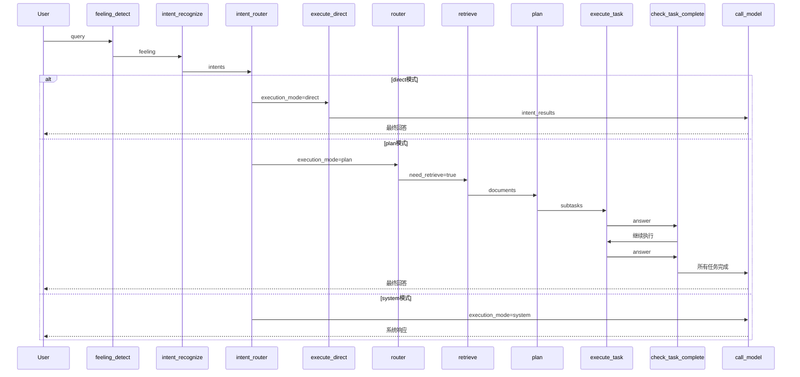

# 智能体框架

基于 AI 的企业级智能体框架，采用前后端分离架构，集成知识库检索（RAG）、工具调用、技能系统和多轮对话能力。系统已迁移至 **LangGraph** 架构，支持状态管理和工作流编排。

## 核心特性

- **分层漏斗路由**: L1 关键词（<1ms）→ L2 向量语义 → L3 LLM 识别，80% 请求在 L1 层处理
- **多意图识别**: 支持同时识别多个意图，如"查询行测技巧并画架构图"
- **模块化 RAG**: 可插拔的索引器、检索器、生成器，支持 ChromaDB / Milvus
- **MCP 工具服务**: 独立部署的工具服务，支持分布式多服务器，动态添加/删除
- **技能系统**: 基于 SKILL.md 的技能匹配和执行引擎，支持数据分析、绘图、旅行规划
- **智能任务规划**: 基于 LLM 的 1-5 级难度评估，自动生成多步骤执行计划
- **状态持久化**: 支持 Memory / Redis 检查点存储，实现会话状态持久化
- **情绪感知**: 6 种情绪检测（default、upbeat、angry、cheerful、depressed、friendly），动态更新 Prompt
- **钉钉集成**: 日程管理（创建、查询、删除）和待办事项，支持钉钉机器人
- **可视化配置**: 前端 UI 管理知识库、MCP 工具、技能安装，支持 Word/Excel/PDF 文件预览
- **情绪感知**: 基于关键词规则的情绪分析（default、upbeat、angry、cheerful、depressed、friendly），动态更新 Prompt

## 项目结构

```
LangGraphAgent/
├── server/                      # Python 后端服务 (Flask)
│   ├── app.py                   # Flask 主应用入口
│   ├── db.py                    # 向量库管理 API
│   ├── DingWebHook.py           # 钉钉 Webhook 入口
│   ├── Dockerfile               # Docker 构建文件
│   ├── docker-compose.yml       # Docker Compose 配置
│   ├── requirements.txt         # Python 依赖
│   ├── modules/                 # 核心功能模块
│   │   ├── langgraph/           # LangGraph 状态图
│   │   │   ├── agent.py         # LangGraph Agent（状态图定义）
│   │   │   ├── state.py         # 状态定义
│   │   │   ├── context_builder.py # 上下文构建器
│   │   │   ├── states/          # 状态类型
│   │   │   ├── executors/       # 执行器（责任链模式）
│   │   │   ├── refiners/        # 结果精炼器
│   │   │   ├── planner/         # 任务规划器
│   │   │   ├── reflection/      # 反思校验器
│   │   │   └── task_generators/ # 任务生成器（责任链模式）
│   │   ├── intent/              # 意图识别模块（2026-05 新增）
│   │   │   ├── intent_types.py  # 意图类型定义
│   │   │   ├── intent_registry.py # 意图注册表（动态注册）
│   │   │   ├── recognizer.py    # LLM 意图识别器（L3）
│   │   │   └ router.py          # 分层漏斗路由器（L1+L2+L3）
│   │   ├── rag/                 # 模块化 RAG 框架
│   │   │   ├── rag.py           # RAG 工作流核心
│   │   │   ├── indexer/         # 索引模块（Chroma/Milvus）
│   │   │   ├── retriever/       # 检索模块（Simple/Reranking/Filtered）
│   │   │   ├── generator/       # 生成模块（Stuff/MapReduce/Refine）
│   │   │   └ router/            # 路由模块（Simple/LLMRouter）
│   │   ├── skill/               # 技能系统模块
│   │   ├── feeling/             # 情绪感知模块
│   │   ├── checkpoint/          # 检查点存储（Memory/Redis）
│   │   ├── document_loaders/    # 文档加载器（PDF/Word/Excel/Text）
│   │   ├── prompt/              # Prompt 模板管理
│   │   ├── rate_limit/          # 限流模块
│   │   ├── sse/                 # SSE 流式响应
│   │   ├── ai_client.py         # AI 客户端（兼容 OpenAI SDK）
│   │   ├── assistant.py         # LangChain Agent（旧版）
│   │   ├── factory.py           # 工厂函数（组件初始化）
│   │   └ logger.py              # 统一日志模块
│   │   └ context.py             # AgentContext 上下文
│   ├── mcp_module/              # MCP 模块（工具服务）
│   │   ├── mcp_server.py        # MCP 服务器核心
│   │   ├── mcp_service.py       # MCP 服务封装
│   │   ├── mcp_config_manager.py # MCP 配置管理
│   │   ├── start.py             # 启动脚本
│   │   └ tools/                 # 工具插件目录
│   │       ├── registry.py      # 工具注册表
│   │       ├── weather_plugin.py # 天气查询
│   │       ├── weather_recommend_plugin.py # 天气推荐
│   │       ├── submit_form_plugin.py # 表单提交
│   │       └ dingtalk/          # 钉钉工具
│   ├── knowledge_base/          # 知识库管理模块
│   ├── skills/                  # 技能库（SKILL.md 格式）
│   ├── user/                    # 用户管理模块
│   ├── api/                     # API 接口层
│   ├── config/                  # 配置文件
│   ├── gateway/                 # 网关配置（Nginx）
│   └── db/                      # 向量数据库存储（Chroma）
├── client/                       # React 前端 (Vite)
│   ├── src/
│   │   ├── components/          # React 组件
│   │   ├── preview/             # 文件预览组件
│   │   ├── stores/              # 状态管理（Zustand）
│   │   ├── api/                 # API 接口封装
│   │   ├── hooks/               # 自定义 Hooks
│   │   └── constants/           # 常量定义
│   ├── package.json
│   ├── vite.config.js
│   ├── Dockerfile
│   └── nginx.conf
├── resources/                   # 资源文件（截图）
├── .env                         # 环境变量配置
└── .gitignore
```

## LangGraph 架构

系统已迁移至 LangGraph 架构，实现状态管理和工作流编排。

### 架构设计原则

1. **分离图定义与业务逻辑**:
   - `LangGraphAgent` (agent.py): 定义状态图结构（节点、边、路由）
   - `ContextBuilder` (context\_builder.py): 构建上下文（RAG 文档、对话历史）
   - `RAGWorkflow` (rag.py): 实现具体业务功能（检索、生成）
2. **分离调度层与执行层**:
   - LangGraph（调度层）：专注于流程控制
   - LangChain Agent（执行层）：通过 tool calling 自主调用工具
3. **状态持久化**: 通过检查点（Checkpoint）机制实现会话状态持久化
4. **工作流编排**: 支持多节点路由、条件分支、循环等复杂工作流

### 完整节点流程



### 执行层详细流程

以用户输入 **"先查询行测技巧，再画架构图"** 为例：

```
用户输入: "先查询行测技巧，再画架构图"
        │
        ▼
intent_recognize (意图识别)
        │
        ├── 检测多意图连接词 "先...再..."
        ├── LLM 分析返回 intents = [
        │     Intent(type="rag_exams", category="rag", order=1),
        │     Intent(type="skill_drawio", category="skill", order=2)
        │   ]
        │
        ▼
intent_router (意图路由)
        │
        ├── 全是简单意图 (RAG + SKILL)
        └── 返回 execution_mode = "direct"
        │
        ▼
execute_direct (直接执行)
        │
        ├── ExecutorRegistry.execute_all(intents)
        │
        ├── [1/2] RAGExecutor → 切换知识库 → 检索 → 生成
        │         └── 返回: "行测蒙题技巧包括..."
        │
        ├── [2/2] SkillExecutor → 加载技能 → Agent 执行
        │         └── 返回: "架构图已生成..."
        │
        └── 收集结果 intent_results = [RAG结果, Skill结果]
        │
        ▼
call_model (生成最终回复)
        │
        ├── 整合多意图结果
        └── 返回: "为您查询到行测蒙题技巧...，同时已生成架构图..."
```

**执行器映射**：

| category | Executor      | 执行流程            |
| -------- | ------------- | --------------- |
| `rag`    | RAGExecutor   | 切换知识库 → 检索 → 生成 |
| `skill`  | SkillExecutor | 加载技能 → Agent 执行 |
| `mcp`    | MCPExecutor   | 调用 MCP 工具       |
| `chat`   | ChatExecutor  | 直接对话            |

### 意图识别节点详解

`intent_recognize` 采用 **分层漏斗路由架构**：

```
IntentRouter.route(query)
    │
    ├─── L1 关键词匹配（<1ms）───────────────────────────────────────────────┐
    │   检查固定指令: /help, exit, yes, no...                               │
    │   命中 → 直接返回 Intent                                              │
    │                                                                        │
    ├─── L2 向量语义匹配（保留入口）─────────────────────────────────────────┤
    │   暂未实现，返回 None                                                  │
    │                                                                        │
    └─── L3 LLM 意图识别（1-2s）─────────────────────────────────────────────┤
        IntentRecognizer.recognize(query)                                   │
        │                                                                   │
        ├── 构建 Prompt（包含所有已注册意图类型及描述）                        │
        ├── 调用 LLM 返回结构化 JSON                                         │
        └── 解析为 List[Intent]                                              │
                                                                            │
    输出: intents = [                                                       │
        Intent(type="rag_exams", category=RAG, content="查询行测技巧", ...), │
        Intent(type="skill_drawio", category=SKILL, content="画架构图", ...) │
    ]                                                                       │
```

### 意图类型动态注册

系统启动时自动从多个来源注册意图类型：

```
factory.py 初始化流程:
    │
    ├── IntentRegistry()                    # 创建注册表
    │   └── 自动注册系统意图: system_help, system_exit, system_confirm
    │
    ├── register_from_skills()              # 从技能注册
    │   └── 生成意图: skill_drawio-skill, skill_analysis...
    │
    ├── register_from_knowledge_bases()     # 从知识库注册
    │   └── 生成意图: rag_exams, rag_politics...
    │
    └── register_from_mcp_tools()           # 从 MCP 工具注册
        └── 生成意图: mcp_weather, mcp_dingtalk_schedule...
```

### 意图类型

| 类别     | 枚举值      | 说明       | 示例                                    |
| ------ | -------- | -------- | ------------------------------------- |
| RAG    | `rag`    | 知识库检索    | rag\_exams, rag\_politics             |
| SKILL  | `skill`  | 技能执行     | skill\_drawio-skill, skill\_analysis  |
| MCP    | `mcp`    | MCP 工具调用 | mcp\_weather, mcp\_dingtalk\_schedule |
| SYSTEM | `system` | 系统指令     | system\_help, system\_exit            |

### 多意图识别

系统支持识别包含多个意图的用户请求：

```
用户输入: "先帮我查询行测蒙题技巧，再帮我画一个架构图"

识别结果:
┌─────────────────────────────────────────────────────────────────────────────┐
│  意图[1]:                                                                    │
│    - 类型: rag_exams                                                         │
│    - 类别: rag                                                               │
│    - 内容: 查询行测绝杀蒙题技巧                                                │
│    - 目标: knowledge_base:exams                                              │
│                                                                             │
│  意图[2]:                                                                    │
│    - 类型: skill_drawio-skill                                                │
│    - 类别: skill                                                             │
│    - 内容: 画一个架构图                                                       │
│    - 目标: skill:drawio-skill                                                │
└─────────────────────────────────────────────────────────────────────────────┘
```

### execute\_task 节点详解

`execute_task` 是核心执行节点，通过 **LangChain Agent** 调用工具：

```
execute_task
    │
    ▼
LangChain Agent.invoke()
    │
    ├─── MCP 工具调用（通过 MCPToolService）────────────────────────────┐
    │                                                                     │
    │   ├── tool: weather_query        # 天气查询                         │
    │   ├── tool: weather_recommend    # 天气推荐                         │
    │   ├── tool: submit_form          # 表单提交                         │
    │   ├── tool: dingtalk_schedule    # 钉钉日程                         │
    │   └── tool: dingtalk_todo        # 钉钉待办                         │
    │                                                                     │
    ├─── 技能工具调用（通过 Skill Tools）─────────────────────────────────┤
    │                                                                     │
    │   注意：技能执行已从 LangGraph 节点转移到 LangChain Agent           │
    │   Agent 通过 skill_list 发现技能，skill_instructions 加载指令       │
    │   自主执行技能任务，无需经过 LangGraph 调度                          │
    │                                                                     │
    └─────────────────────────────────────────────────────────────────────┘
```

### 节点说明

| 节点                    | 职责   | 说明                               |
| --------------------- | ---- | -------------------------------- |
| `feeling_detect`      | 情绪检测 | 检测用户情绪，动态更新 Prompt               |
| `intent_recognize`    | 意图识别 | 识别用户意图，支持多意图识别（L1关键词+L3 LLM）     |
| `intent_router`       | 意图路由 | 根据意图类型决定执行路径（direct/plan/system） |
| `router`              | 智能路由 | 判断是否需要检索，选择知识库                   |
| `retrieve`            | 文档检索 | 从向量库检索相关文档                       |
| `generate`            | 生成回答 | 基于检索结果生成回答                       |
| `plan`                | 任务规划 | 评估问题难度，拆分子任务（RAG 增强）             |
| `execute_task`        | 执行任务 | 调用 MCP 工具（LangChain Agent 执行）    |
| `check_task_complete` | 检查完成 | 判断是否还有子任务                        |
| `call_model`          | 调用模型 | 最终回复生成                           |

## 模块化 RAG 框架

将 RAG 流程拆分为可插拔的独立模块，支持自由组合和扩展。

### 模块结构

```
RAG 流程:
用户提问 → 智能路由 → 选择知识库 → 检索文档（含查询扩展）→ 生成回答 → 返回结果
           ↓           ↓           ↓                  ↓         ↓
         Router    Knowledge    Retriever          Generator
           ↓           ↓           ↓                  ↓
       LLMRouter   Multi KB    SimpleVector      BaseGenerator
                                    ↓
                              Chroma/Milvus
```

### 核心模块

| 模块        | 职责            | 基类            | 实现类                                                          |
| --------- | ------------- | ------------- | ------------------------------------------------------------ |
| Indexer   | 文档加载、切分、向量化存储 | BaseIndexer   | ChromaIndexer, MilvusIndexer                                 |
| Retriever | 从索引中检索相关文档    | BaseRetriever | SimpleVectorRetriever, RerankingRetriever, FilteredRetriever |
| Generator | 基于检索文档生成回答    | BaseGenerator | StuffGenerator, MapReduceGenerator, RefineGenerator          |
| Router    | 决定是否检索、选择知识库  | BaseRouter    | SimpleRouter, LLMRouter                                      |

### 多知识库支持

| 知识库名称    | 用途   | 示例内容          |
| -------- | ---- | ------------- |
| exams    | 考试资料 | 行测蒙题技巧、考试复习资料 |
| politics | 政策文档 | 党的会议文件、政策文件   |
| general  | 通用知识 | 产品文档、公司信息     |

### 智能路由（LLMRouter）

使用大语言模型分析用户问题，实现：

1. **判断是否需要检索**：区分需要知识库的问题和常识/创意问题
2. **选择知识库**：根据问题领域选择合适的知识库
3. **选择检索策略**：根据问题复杂度调整检索参数

### 查询扩展

通过 LLM 生成多个相关查询词，提高召回率：

1. 接收用户原始查询
2. 使用 LLM 生成 3-5 个相关查询词
3. 对每个查询词执行检索
4. 合并结果并去重
5. 返回最终检索结果

## 技能系统

技能系统基于 **SKILL.md** 格式定义技能，支持语义匹配和脚本执行，实现可扩展的能力增强。

### 技能定义格式

每个技能是一个独立目录，包含 `SKILL.md` 文件：

```
skills/
├── drawio-skill/           # 绘图技能
│   ├── SKILL.md           # 技能定义
│   ├── scripts/           # 脚本文件
│   ├── references/        # 参考文档
│   └── styles/            # 样式配置
├── data-analysis/         # 数据分析技能
│   └── SKILL.md
├── trip-plan/             # 旅行规划技能
│   └── SKILL.md
└── tldraw-skill/          # TLDraw 技能
    └── SKILL.md
```

**SKILL.md 结构**：

```yaml
---
name: drawio-skill
version: 1.5.2
description: 用于生成流程图、架构图、ER图、UML图等可视化图表
license: MIT
---

# Draw.io Diagrams

## Overview
生成 .drawio XML 文件并导出为 PNG/SVG/PDF...

## Workflow
1. 检查依赖 → 2. 规划布局 → 3. 生成 XML → 4. 导出预览 → 5. 自检修正 → 6. 用户确认 → 7. 最终导出
```

### 技能系统架构

```
┌─────────────────────────────────────────────────────────────────┐
│                        技能系统架构                               │
├─────────────────────────────────────────────────────────────────┤
│                                                                 │
│  ┌─────────────┐    ┌─────────────┐    ┌─────────────┐        │
│  │ SkillLoader │───▶│SkillIndexer │───▶│SkillMatcher│        │
│  │  (加载器)   │    │  (索引器)   │    │  (匹配器)   │        │
│  └─────────────┘    └─────────────┘    └──────┬──────┘        │
│         │                  │                   │               │
│         ▼                  ▼                   ▼               │
│  ┌─────────────┐    ┌─────────────┐    ┌─────────────┐        │
│  │ SKILL.md    │    │  ChromaDB   │    │ 语义/关键词  │        │
│  │ 解析加载    │    │ 向量存储    │    │ 双策略匹配  │        │
│  └─────────────┘    └─────────────┘    └─────────────┘        │
│                                                                 │
│                        匹配成功后                               │
│                            │                                   │
│                            ▼                                   │
│                   ┌─────────────────┐                          │
│                   │  SkillExecutor  │                          │
│                   │    (执行器)      │                          │
│                   └────────┬────────┘                          │
│                            │                                   │
│              ┌─────────────┼─────────────┐                     │
│              ▼             ▼             ▼                     │
│        ┌──────────┐ ┌──────────┐ ┌──────────┐                 │
│        │ 脚本执行  │ │ 指令返回 │ │ 资源加载 │                 │
│        │ (.py/.sh)│ │(LLM执行) │ │(参考文档)│                 │
│        └──────────┘ └──────────┘ └──────────┘                 │
└─────────────────────────────────────────────────────────────────┘
```

### 核心组件

| 组件            | 文件          | 职责                    |
| ------------- | ----------- | --------------------- |
| SkillLoader   | loader.py   | 加载 SKILL.md 文件，延迟加载策略 |
| SkillIndexer  | indexer.py  | 将技能向量化存储到 ChromaDB    |
| SkillMatcher  | matcher.py  | 语义匹配 + 关键词匹配双策略       |
| SkillExecutor | executor.py | 安全执行技能脚本，工作目录隔离       |

### 技能匹配策略

采用 **双策略匹配**，优先语义匹配，关键词兜底：

```
用户查询: "帮我画一个系统架构图"
        │
        ▼
┌───────────────────────────────────────────────┐
│  SkillMatcher.match(query)                     │
├───────────────────────────────────────────────┤
│                                               │
│  策略 1: 语义匹配（优先）                        │
│  ├── 调用 SkillIndexer.search(query, k=3)      │
│  ├── 计算向量相似度                            │
│  ├── 阈值判断 (threshold=1.5)                  │
│  └── 命中 → 返回技能                           │
│                                               │
│  策略 2: 关键词匹配（兜底）                      │
│  ├── 提取查询关键词                            │
│  ├── 匹配技能名称和描述                         │
│  ├── 精确匹配 → 返回技能                       │
│  └── 模糊匹配 → 返回技能                       │
│                                               │
└───────────────────────────────────────────────┘
        │
        ▼
返回: {name: "drawio-skill", description: "...", instructions: "..."}
```

### 技能执行流程

技能执行有两种模式：

**模式 1: LLM 自主执行（推荐）**

```
LangChain Agent 获取 skill_instructions
        │
        ▼
LLM 根据 instructions 自主完成任务
        │
        ▼
返回结果给用户
```

**模式 2: 脚本执行**

```python
# 执行技能脚本
executor.run_script(
    skill_name="drawio-skill",
    script_path="scripts/export.py",
    args=["--format", "png"],
    timeout=30
)
```

### 内置技能

| 技能名称          | 功能                 | 关键词            |
| ------------- | ------------------ | -------------- |
| drawio-skill  | 生成流程图、架构图、ER图、UML图 | 画图、架构图、流程图、ER图 |
| data-analysis | 数据分析、统计计算          | 分析数据、统计、报表     |
| trip-plan     | 旅行规划、行程安排          | 旅行、旅游、行程       |
| tldraw-skill  | TLDraw 绘图          | tldraw、手绘风格    |

### 技能扩展

添加新技能只需创建目录和 SKILL.md 文件：

```bash
# 1. 创建技能目录
mkdir server/skills/my-skill

# 2. 创建 SKILL.md
cat > server/skills/my-skill/SKILL.md << 'EOF'
---
name: my-skill
version: 1.0.0
description: 我的自定义技能
---

# My Skill

## Overview
技能概述...

## Instructions
执行指令...
EOF

# 3. 重启服务，自动加载
```

系统启动时会自动：

1. 扫描 `skills/` 目录
2. 加载所有 SKILL.md 文件
3. 向量化索引技能描述
4. 注册到意图识别系统

## MCP 架构

MCP（Model Context Protocol）服务器负责管理和提供工具服务，支持独立部署。

### MCP 服务器架构

```
┌───────────────────────────────────────────────────────┐
│                MCP 服务器 (8080端口)                    │
│  ┌────────────────────────────────────────────────────┐
│  │           工具注册表 (_TOOL_REGISTRY)                │
│  │  ┌─────────┐ ┌─────────┐ ┌─────────────┐           │
│  │  │get_weather│ │get_weather│ │dingtalk_   │           │
│  │  │           │ │_forecast │ │schedule    │           │
│  │  └────┬────┘ └────┬────┘ └──────┬──────┘           │
│  └───────┼───────────┼─────────────┼                  │
│          │           │             │                  │
│          └───────────┼─────────────┘                  │
│                      ↓                                │
│            ┌─────────────────┐                        │
│            │  FastMCP Server │ ← Streamable HTTP      │
│            └─────────────────┘                        │
└───────────────────────────────────────────────────────┘
                          ↑
                          │ HTTP 请求
                          ↓
┌─────────────────────────────────────────────────────┐
│              应用服务器 (5000端口)                    │
│  ┌─────────────┐    ┌─────────────┐                 │
│  │   Agent     │←───│MCPToolService│                │
│  │ (LangGraph) │    │   (客户端)   │                 │
│  └─────────────┘    └─────────────┘                 │
└─────────────────────────────────────────────────────┘
```

### MCP 多服务器支持

系统支持从多个 MCP 服务器获取工具，实现工具服务的分布式部署：

```python
MCP_SERVERS = [
    {"name": "default", "url": "http://localhost:8080/mcp"},
    {"name": "dingtalk", "url": "http://localhost:8081/mcp"},
    {"name": "custom", "url": "http://custom-server:8080/mcp"}
]
```

### 工具注册机制

工具通过装饰器注册到全局注册表：

```python
from mcp_module.tools.registry import register_tool

@register_tool(
    name="get_weather",
    description="查询指定城市的实时天气",
    parameters=[
        {"name": "city", "type": "string", "description": "城市名称", "required": True}
    ],
    return_type="string"
)
def get_weather(city: str) -> str:
    return f"{city}今天晴，温度25°C"
```

### 钉钉工具列表

| 工具名称                       | 功能   | 参数                                    |
| -------------------------- | ---- | ------------------------------------- |
| `create_dingtalk_schedule` | 创建日程 | summary, isAllDay, start/end datetime |
| `query_dingtalk_schedule`  | 查询日程 | schedule\_id 或查询条件                    |
| `delete_dingtalk_schedule` | 删除日程 | schedule\_id                          |
| `create_dingtalk_todo`     | 创建待办 | summary, due\_date                    |

## 快速开始

### 环境要求

- Python >= 3.10
- Node.js >= 16
- 阿里云百炼 API 密钥（或 OpenAI API）

### 后端启动

```bash
# 1. 安装依赖
cd server
pip install -r requirements.txt

# 2. 启动 MCP 服务（工具服务）
python mcp_module/start.py

# 3. 新开终端，启动应用服务
python app.py
```

后端服务：

- MCP 服务: <http://localhost:8080/mcp>
- 应用服务: <http://localhost:5000>

### 前端启动

```bash
cd client
npm install
npm run dev
```

前端服务：

- 智能体界面: <http://localhost:5173>
- 向量库管理: <http://localhost:5174>

### Docker 部署

```bash
cd server
docker-compose up -d
```

服务端口：

- redis: 6379
- mcp: 8080
- app: 8000
- db: 5001
- frontend: 5174

访问地址：

- 智能体: <http://localhost:8000>
- 向量库管理: <http://localhost:5174>

## 配置中心

配置中心提供可视化的管理界面，支持知识库、MCP 服务器、技能的动态配置和管理。

### 配置中心架构

```
┌─────────────────────────────────────────────────────────────────┐
│                     前端配置中心 (React + Zustand)                │
│  ┌────────────┐  ┌────────────┐  ┌────────────┐  ┌───────────┐ │
│  │  Sidebar   │  │DatabasePanel│  │  MCPPanel │  │SkillPanel │ │
│  └────────────┘  └────────────┘  └────────────┘  └───────────┘ │
└──────────────────────────────┼──────────────────────────────────┘
                               │ HTTP API
                               ▼
┌─────────────────────────────────────────────────────────────────┐
│                     后端配置 API (Flask)                          │
│  /mcp/servers  →  MCP 服务器 CRUD                                │
│  /skills       →  技能安装/删除                                   │
│  /db/*         →  知识库管理                                      │
└──────────────────────────────┼──────────────────────────────────┘
                               │
                               ▼
┌─────────────────────────────────────────────────────────────────┐
│                     配置文件存储                                  │
│  config/mcp_servers.yaml     →  MCP 服务器配置                    │
│  config/prompt_config.yaml   →  Prompt 模板配置                   │
│  knowledge_base/databases.json →  知识库元数据                    │
│  skills/*/SKILL.md           →  技能定义                          │
└─────────────────────────────────────────────────────────────────┘
```

### 功能模块

配置中心包含以下管理功能：

| 功能                 | 说明                           |
| ------------------ | ---------------------------- |
| **技能管理**           | 安装、卸载、配置技能，可通过管理页面动态添加新技能    |
| **MCP 工具配置**       | 添加、删除 MCP 服务器，配置 MCP 工具连接参数  |
| **数据库管理（RAG 向量库）** | 创建、删除向量数据库，上传文档，管理知识库        |
| **钉钉文字仓颉编辑器**      | 集成钉钉文字仓颉编辑器，支持 Word 文档在线预览   |
| **钉钉表格纵横 SDK**     | 集成钉钉表格纵横 SDK，支持 Excel 文件在线预览 |
| **PDF 文件预览**       | 支持 PDF 文件在线预览，无需下载即可查看文档内容   |

### 技能管理

通过配置中心可以：

- **安装技能**: 从预置技能列表中选择安装，或导入自定义技能
- **卸载技能**: 删除不需要的技能

### MCP 工具配置

通过配置中心可以：

- **添加 MCP 服务器**: 输入服务器地址和认证信息，自动连接
- **删除 MCP 服务器**: 移除不需要的 MCP 服务器连接
- **工具列表**: 查看已连接 MCP 服务器提供的工具

### 数据库管理（RAG 向量库）

通过配置中心可以：

- **创建知识库**: 创建新的向量数据库，设置名称和描述
- **删除知识库**: 删除不需要的知识库及其索引数据
- **上传文档**: 上传 .txt、.pdf、.docx 格式的文档，自动向量化

### 钉钉文字仓颉编辑器

集成钉钉文字仓颉编辑器，提供文档在线预览能力。

官网： `https://page.dingtalk.com/app/we-editor/site/index.html?spm=a2q1e.24441682.0.0.202e789eXdrRGA`

功能特性：

- **Word 文档预览**: 在线预览 .doc、.docx 格式文档，无需下载
- **格式保留**: 完整保留文档格式、样式、表格等元素
- **高清渲染**: 保持文档原始排版和清晰度

### 钉钉表格纵横 SDK

集成钉钉表格纵横 SDK，提供表格在线预览能力。

官网： `https://page.dingtalk.com/app/alidocs/zongheng-site/index.html#/`

功能特性：

- **Excel 文件预览**: 在线预览 .xls、.xlsx 格式文件，支持复杂表格
- **格式兼容**: 完美兼容 Excel 各种格式和功能
- **高清渲染**: 保持表格原始排版和清晰度

### PDF 文件预览

支持 PDF 文件的在线预览功能：

- **PDF 文档预览**: 在线预览 .pdf 格式文件，无需下载即可查看
- **高清渲染**: 保持文档原始排版和清晰度
- **快速加载**: 优化加载速度，提升用户体验
- **多页浏览**: 支持多页 PDF 文档的流畅浏览

### 访问配置中心

配置中心前端界面访问地址：`http://localhost:5174`（向量库管理界面）

## 配置说明

### 环境变量 (.env)

```env
# AI API 配置
API_KEY=your_api_key
BASE_URL=https://dashscope.aliyuncs.com/compatible-mode/v1
MODEL=qwen3.5-flash
EMBEDDING_MODEL=text-embedding-v3

# 向量数据库配置
VECTOR_STORE_TYPE=chroma
VECTOR_STORE_PERSIST_DIRECTORY=db/chroma
VECTOR_STORE_COLLECTION_NAME=knowledge_base

# 检查点存储配置
CHECKPOINT_STORAGE=memory
REDIS_HOST=localhost
REDIS_PORT=6379
REDIS_DB=0
REDIS_PASSWORD=

# MCP 配置
MCP_HOST=0.0.0.0
MCP_PORT=8080
MCP_SERVERS=[{"name":"default","url":"http://localhost:8080/mcp"}]

# 钉钉配置（可选）
DINGTALK_CLIENT_ID=your_app_key
DINGTALK_CLIENT_SECRET=your_app_secret
```

### 检查点存储

系统支持两种检查点存储方式：

| 存储类型        | 适用场景  | 特点              | 配置                          |
| ----------- | ----- | --------------- | --------------------------- |
| MemorySaver | 开发/测试 | 内存存储，重启丢失       | `CHECKPOINT_STORAGE=memory` |
| RedisSaver  | 生产环境  | Redis 持久化，支持分布式 | `CHECKPOINT_STORAGE=redis`  |

**Redis 启动方式**：

```bash
# 使用 Docker（推荐）
docker run -d -p 6379:6379 redis

# 或本地安装的 Redis
redis-server
```

**检查点工厂模式**：

```python
# 注册存储实现
CheckpointFactory.register("memory", MemorySaver)
CheckpointFactory.register("redis", RedisSaver)

# 构建实例
checkpointer = CheckpointFactory.build(name="memory")
```

## API 接口

### 对话接口

```http
POST /chat
Content-Type: application/json

{
  "message": "用户输入",
  "session_id": "optional-session-id"
}
```

**响应示例**：

```json
{
  "reply": "AI回复内容",
  "feeling": {"feeling": "cheerful", "score": 3},
  "tool_calls": [],
  "session_id": "会话ID",
  "finished": false
}
```

### SSE 流式对话

```http
POST /chat/stream
Content-Type: application/json

{
  "message": "用户输入",
  "session_id": "optional-session-id"
}
```

### 向量库管理 API

```http
GET    /api/databases           # 获取知识库列表
POST   /api/databases           # 创建知识库
GET    /api/databases/{name}    # 获取知识库详情
PUT    /api/databases/{name}    # 更新知识库信息
DELETE /api/databases/{name}    # 删除知识库
POST   /api/databases/{name}/upload  # 上传文档
```

### MCP 配置 API

```http
GET  /api/mcp/servers     # 获取 MCP 服务器列表
POST /api/mcp/servers     # 添加 MCP 服务器
DELETE /api/mcp/servers/{name}  # 删除 MCP 服务器
```

### 技能配置 API

```http
GET  /api/skills          # 获取技能列表
POST /api/skills/install  # 安装技能
DELETE /api/skills/{name} # 删除技能
```

## 自定义扩展

### 修改系统提示词

编辑 `backend/modules/prompt/__init__.py` 中的 `PromptClass` 类，修改 `SystemPrompt` 和 `MOODS` 配置。

### 自定义 FewShot 示例

```python
DEFAULT_FEW_SHOT_EXAMPLES = [
    {"user_query": "你好", "assistant_response": "您好！请问有什么可以帮助您的？"},
    {"user_query": "你们有什么产品?", "assistant_response": "我们提供多种优质产品..."},
]
```

### 添加新工具

```python
# backend/mcp_module/tools/my_tool.py
from mcp_module.tools.registry import register_tool

@register_tool(
    name="my_tool",
    description="我的自定义工具",
    parameters=[...],
    return_type="string"
)
def my_tool(param1: str) -> str:
    return "工具执行结果"
```

### 添加新技能

```bash
mkdir server/skills/my-skill

cat > server/skills/my-skill/SKILL.md << 'EOF'
# my-skill

## Description
技能描述

## Instructions
执行指令...
EOF
```

### 更新知识库

```bash
# 在 backend/knowledge_base/ 添加或修改文档
cp document.pdf server/knowledge_base/my_kb/

# 重启服务，系统自动重新向量化
```

### 扩展 RAG 模块

```python
# 自定义检索器
class MyRetriever(BaseRetriever):
    def retrieve(self, query: str, top_k: int = 5) -> List[Document]:
        # 自定义检索逻辑
        return documents

# 注册到工厂
RetrieverFactory.register("my_retriever", MyRetriever)
```

## 技术栈

### 后端

| 类别       | 技术                    | 版本    | 说明            |
| -------- | --------------------- | ----- | ------------- |
| Web 框架   | Flask                 | 3.0+  | RESTful API   |
| Agent 框架 | LangChain             | 1.0+  | Agent 和工具框架   |
| 状态编排     | LangGraph             | 1.0+  | 状态图工作流        |
| 向量数据库    | ChromaDB              | 0.5+  | 默认向量存储        |
| 向量数据库    | Milvus                | 2.4+  | 可选向量存储        |
| 工具协议     | MCP                   | 1.0+  | 工具服务协议        |
| 状态持久化    | Redis                 | 7.2+  | 可选检查点存储       |
| AI SDK   | OpenAI SDK            | 1.40+ | 兼容阿里云百炼       |
| 技能框架     | pydantic-ai-skills    | 0.10+ | 技能加载          |
| 重排序      | sentence-transformers | 3.2.0 | 检索重排序         |
| 钉钉集成     | dingtalk-stream       | 0.24+ | 钉钉 Stream API |

### 前端

| 类别       | 技术                  | 版本    | 说明         |
| -------- | ------------------- | ----- | ---------- |
| UI 框架    | React               | 18.2  | 组件化 UI     |
| 构建工具     | Vite                | 5.0+  | 快速构建       |
| 状态管理     | Zustand             | 5.0+  | 轻量状态管理     |
| HTTP 请求  | Axios               | 1.16+ | API 请求     |
| PDF 预览   | react-pdf           | 10.4+ | PDF 文件预览   |
| Word 预览  | mammoth-plus-plus-2 | 1.7+  | Word 文件预览  |
| Excel 预览 | exceljs             | 4.4+  | Excel 文件预览 |

### AI 服务

| 类别     | 服务                | 说明       |
| ------ | ----------------- | -------- |
| 对话模型   | qwen3.5-flash     | 阿里云百炼    |
| 向量化模型  | text-embedding-v3 | 文档向量化    |
| API 平台 | 阿里云百炼 / OpenAI    | 兼容两种 API |

## 钉钉智能会话助手

系统已完成钉钉智能会话助手的开发和测试验证。

### 功能特性

- **智能问答**: 基于知识库的智能问答服务
- **日程管理**: 创建、查询、删除钉钉日程
- **待办事项**: 创建钉钉待办任务
- **情绪感知**: 根据用户情绪调整回复语气

### 钉钉部署配置

1. 在钉钉开放平台创建企业内部应用
2. 配置应用密钥（Client ID / Client Secret）
3. 在 `.env` 文件中配置钉钉参数
4. 部署服务并配置钉钉机器人回调地址

```env
# 钉钉配置
DINGTALK_CLIENT_ID=your_app_key
DINGTALK_CLIENT_SECRET=your_app_secret
```

## 功能展示

### Docker 容器化部署

系统支持 Docker 容器化部署，通过 `docker-compose` 一键启动所有服务：


### 复杂任务规划

系统支持基于 LLM 的智能任务规划，根据问题难度自动生成多步骤执行计划：

| 难度等级 | 描述        | 任务数量 |
| ---- | --------- | ---- |
| 1级   | 简单事实查询    | 1个任务 |
| 2级   | 需要简单推理    | 1个任务 |
| 3级   | 需要多步骤分析   | 2个任务 |
| 4级   | 需要综合多领域知识 | 3个任务 |
| 5级   | 需要创造性解决方案 | 4个任务 |

### 测试验证截图

#### 核心功能展示


#### 复杂任务规划与执行


#### 技能使用（SKILL）


#### 配置管理界面（支持预览 Word/Excel/PDF 等文件）


## 项目演进

### 已完成功能

- ✅ MCP 架构迁移
- ✅ 工具独立部署
- ✅ Streamable HTTP 支持
- ✅ 统一日志模块
- ✅ 集中配置管理
- ✅ 模块化 RAG 框架
- ✅ 限流模块集成
- ✅ 多知识库支持
- ✅ 智能路由（LLMRouter）
- ✅ 查询扩展功能
- ✅ LangGraph 架构迁移
- ✅ 状态持久化检查点
- ✅ 智能任务规划（Task Planner）
- ✅ 技能系统（Skill System）
- ✅ 技能匹配与执行引擎
- ✅ 意图识别系统（分层漏斗路由）
- ✅ 多意图识别
- ✅ 钉钉集成（日程、待办）
- ✅ Docker 容器化部署
- ✅ 可视化配置中心
- ✅ 文件预览（Word/Excel/PDF）

### 后续优化方向

- 🔄 数据库替代 JSON 存储
- 🔄 API 安全验证
- 🔄 L2 向量语义匹配实现
- 🔄 更多技能支持

## License

MIT License
