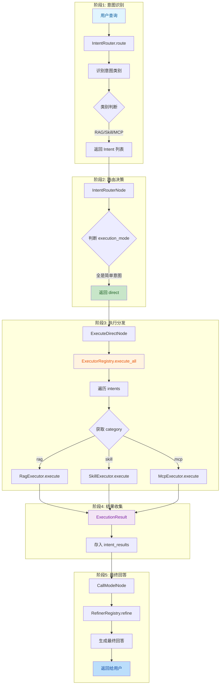
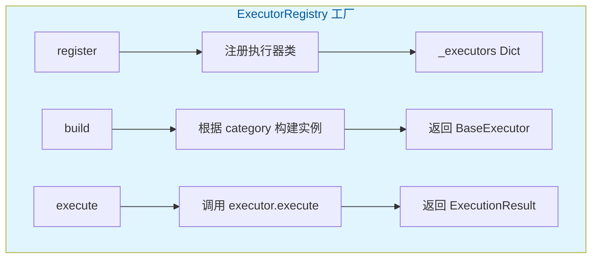
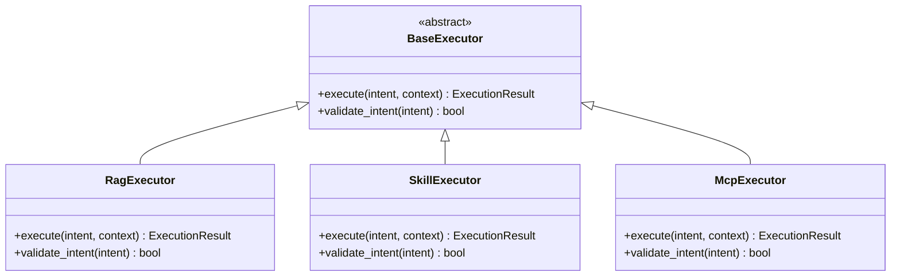
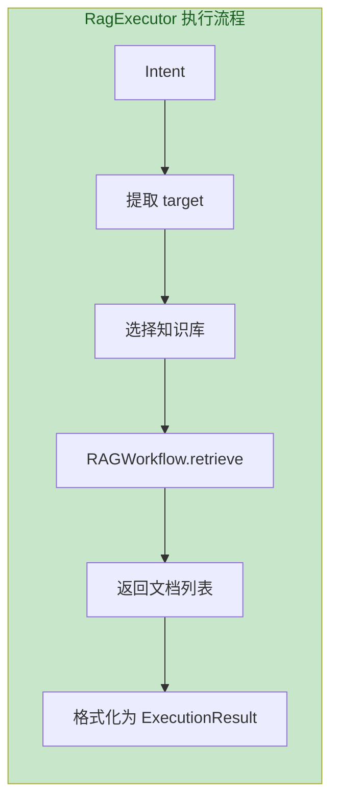
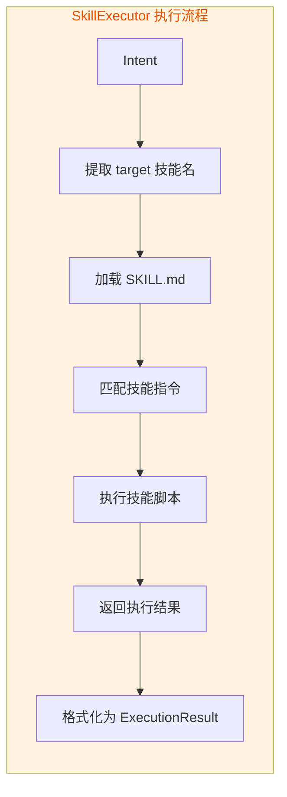
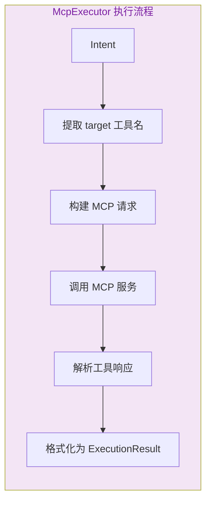
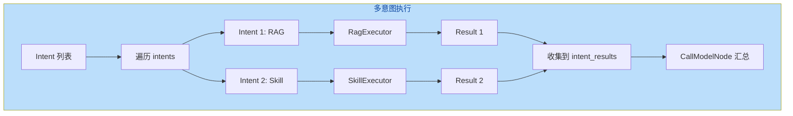

# Direct模式流程（直接执行）

> 文档版本：v1.0  
> 更新时间：2026-05-28  
> 核心模块：`server/modules/langgraph/executors/`

---

## 目录

- [一、流程概述](#一流程概述)
- [二、完整流程图](#二完整流程图)
- [三、执行器架构](#三执行器架构)
- [四、各类执行器详解](#四各类执行器详解)
- [五、多意图处理](#五多意图处理)
- [六、关键代码路径](#六关键代码路径)
- [七、扩展指南](#七扩展指南)

---

## 一、流程概述

Direct模式用于处理**简单意图**（RAG/Skill/MCP），直接调用对应执行器：

| 意图类别 | 执行器 | 功能 |
|----------|--------|------|
| **RAG** | `RagExecutor` | 知识库检索 |
| **SKILL** | `SkillExecutor` | 技能执行 |
| **MCP** | `McpExecutor` | MCP工具调用 |

---

## 二、完整流程图



---

## 三、执行器架构

### 3.1 执行器注册表（工厂模式）



### 3.2 执行器类继承关系



### 3.3 ExecutionResult 结构

```python
ExecutionResult(
    success=True,              # 是否成功
    content="检索结果...",     # 执行内容
    error=None,                # 错误信息（如有）
)
```

---

## 四、各类执行器详解

### 4.1 RagExecutor 流程



### 4.2 SkillExecutor 流程



### 4.3 McpExecutor 流程



---

## 五、多意图处理

### 5.1 多意图执行流程



### 5.2 多意图示例

**用户输入**: "查询文档内容，然后画一个流程图"

```python
intents = [
    Intent(type="rag_query", category="RAG", content="查询文档内容", order=1),
    Intent(type="skill_execute", category="SKILL", content="画流程图", target="drawio-skill", order=2),
]
```

**执行顺序**: RAG检索 → Skill执行 → 结果汇总

---

## 六、关键代码路径

| 步骤 | 文件 | 关键函数 | 行号 |
|------|------|----------|------|
| 执行入口 | [execute.py](file:///d:/办公/AI/langgraph-agent/server/modules/langgraph/nodes/execute.py) | `ExecuteDirectNode.__call__()` | L22-55 |
| 执行器注册 | [registry.py](file:///d:/办公/AI/langgraph-agent/server/modules/langgraph/executors/registry.py) | `ExecutorRegistry.register()` | L20-35 |
| 执行器构建 | [registry.py](file:///d:/办公/AI/langgraph-agent/server/modules/langgraph/executors/registry.py) | `ExecutorRegistry.build()` | L37-55 |
| 执行分发 | [registry.py](file:///d:/办公/AI/langgraph-agent/server/modules/langgraph/executors/registry.py) | `ExecutorRegistry.execute_all()` | L127-154 |
| RAG执行 | [rag_executor.py](file:///d:/办公/AI/langgraph-agent/server/modules/langgraph/executors/rag_executor.py) | `RagExecutor.execute()` | - |
| Skill执行 | [skill_executor.py](file:///d:/办公/AI/langgraph-agent/server/modules/langgraph/executors/skill_executor.py) | `SkillExecutor.execute()` | - |
| MCP执行 | [mcp_executor.py](file:///d:/办公/AI/langgraph-agent/server/modules/langgraph/executors/mcp_executor.py) | `McpExecutor.execute()` | - |

---

## 七、扩展指南

### 7.1 新增执行器

```python
# 1. 创建新执行器类
class WebSearchExecutor(BaseExecutor):
    def execute(self, intent: Dict, context: Dict) -> ExecutionResult:
        query = intent.get("content")
        results = self._search_engine.search(query)
        return ExecutionResult(success=True, content=results)
    
    def validate_intent(self, intent: Dict) -> bool:
        return intent.get("category") == "web_search"

# 2. 注册执行器
ExecutorRegistry.register("web_search", WebSearchExecutor)

# 3. 构建时传入依赖
executors = ExecutorRegistry.build_all(search_engine=my_search_engine)
```

### 7.2 执行器依赖注入

```python
# 通过 kwargs 传入依赖
executors = ExecutorRegistry.build_all(
    rag_workflow=rag_workflow,
    agent=agent,
    skill_registry=skill_registry,
    mcp_client=mcp_client,
)
```

---

## 相关文档

- [LangGraph状态图总览](./LangGraph状态图总览.md)
- [意图识别流程](./意图识别流程.md)
- [技能系统流程](./技能系统流程.md)
- [MCP工具调用流程](./MCP工具调用流程.md)