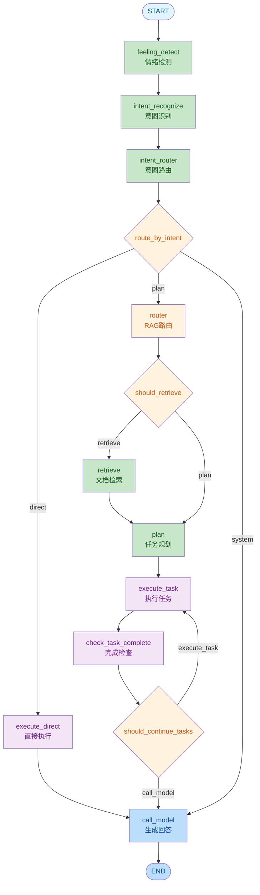
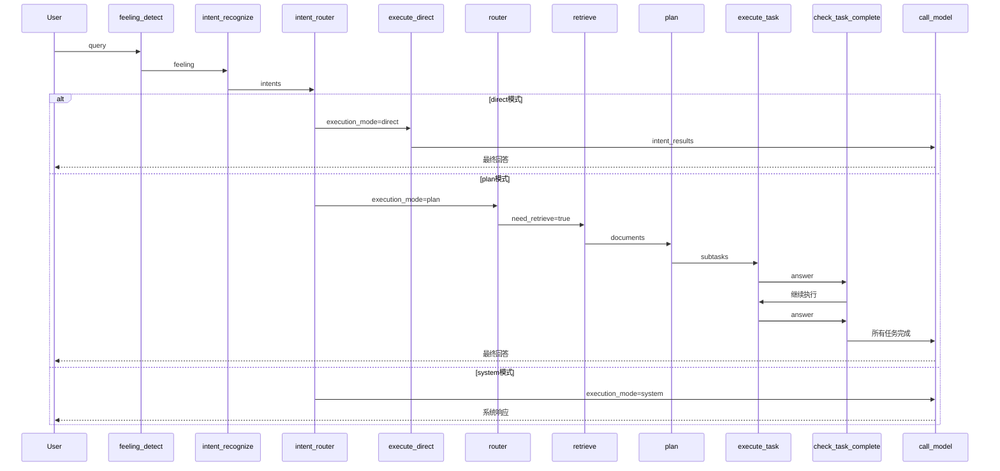
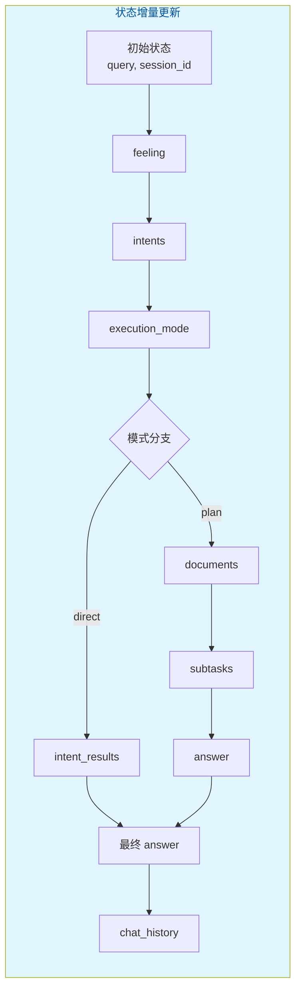
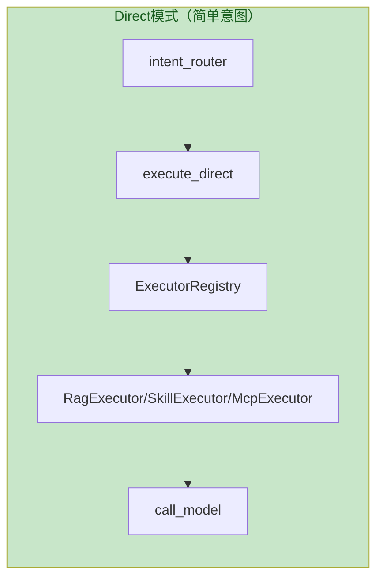
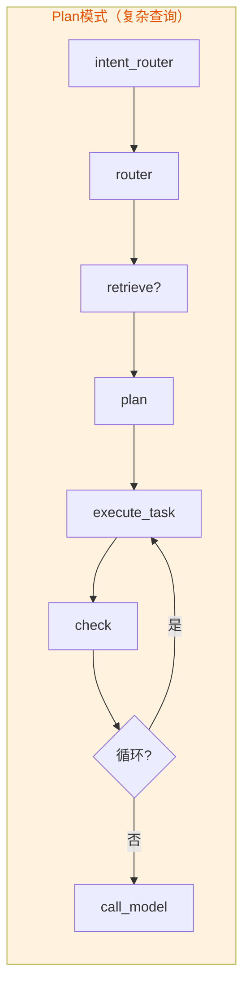
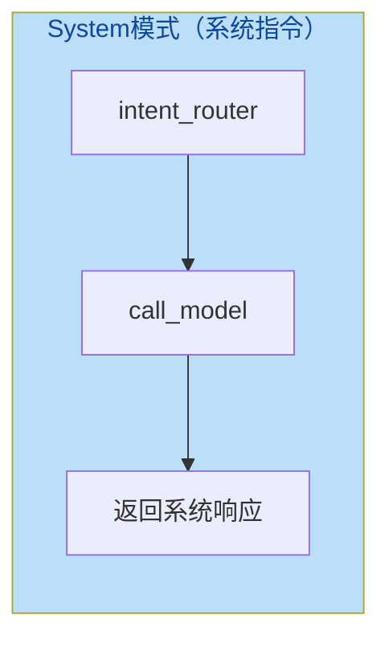

# LangGraph状态图总览

> 文档版本：v1.0  
> 更新时间：2026-05-28  
> 核心模块：`server/modules/langgraph/`

---

## 目录

- [一、架构概述](#一架构概述)
- [二、完整状态图](#二完整状态图)
- [三、节点详解](#三节点详解)
- [四、条件路由](#四条件路由)
- [五、状态定义](#五状态定义)
- [六、三种执行模式](#六三种执行模式)
- [七、关键代码路径](#七关键代码路径)

---

## 一、架构概述

LangGraph状态图采用**模块化节点设计**，支持三种执行模式：

| 模式 | 适用场景 | 流程 |
|------|----------|------|
| **direct** | 简单意图（RAG/Skill/MCP） | 意图识别 → 直接执行 → 返回 |
| **plan** | 复杂查询 | 意图识别 → RAG检索 → 任务规划 → 循环执行 → 返回 |
| **system** | 系统指令 | 意图识别 → 直接返回 |

---

## 二、完整状态图



---

## 三、节点详解

### 3.1 节点列表

| 节点 | 文件 | 职责 | 输入 | 输出 |
|------|------|------|------|------|
| **feeling_detect** | [nodes/feeling.py](file:///d:/办公/AI/langgraph-agent/server/modules/langgraph/nodes/feeling.py) | 情绪检测 | `query` | `feeling` |
| **intent_recognize** | [nodes/intent.py](file:///d:/办公/AI/langgraph-agent/server/modules/langgraph/nodes/intent.py) | 意图识别 | `query` | `intents`, `is_multi_intent` |
| **intent_router** | [nodes/intent.py](file:///d:/办公/AI/langgraph-agent/server/modules/langgraph/nodes/intent.py) | 意图路由 | `intents` | `execution_mode` |
| **execute_direct** | [nodes/execute.py](file:///d:/办公/AI/langgraph-agent/server/modules/langgraph/nodes/execute.py) | 直接执行 | `intents` | `intent_results` |
| **router** | [nodes/rag.py](file:///d:/办公/AI/langgraph-agent/server/modules/langgraph/nodes/rag.py) | RAG路由 | `query` | `need_retrieve` |
| **retrieve** | [nodes/rag.py](file:///d:/办公/AI/langgraph-agent/server/modules/langgraph/nodes/rag.py) | 文档检索 | `query` | `documents` |
| **plan** | [nodes/plan.py](file:///d:/办公/AI/langgraph-agent/server/modules/langgraph/nodes/plan.py) | 任务规划 | `query`, `documents` | `subtasks` |
| **execute_task** | [nodes/execute.py](file:///d:/办公/AI/langgraph-agent/server/modules/langgraph/nodes/execute.py) | 执行任务 | `subtasks`, `current_task_idx` | `answer` |
| **check_task_complete** | [nodes/execute.py](file:///d:/办公/AI/langgraph-agent/server/modules/langgraph/nodes/execute.py) | 完成检查 | `subtasks`, `answer` | `is_task_completed` |
| **call_model** | [nodes/model.py](file:///d:/办公/AI/langgraph-agent/server/modules/langgraph/nodes/model.py) | 生成回答 | `answer`, `intent_results` | 最终回答 |

### 3.2 节点执行顺序



---

## 四、条件路由

### 4.1 route_by_intent（意图路由）

```python
# edges.py
def route_by_intent(state: Dict[str, Any]) -> Literal["direct", "plan", "system"]:
    intents = state.get("intents", [])
    
    # 1. 检查系统指令
    for intent in intents:
        if intent["category"] == "SYSTEM":
            return "system"
    
    # 2. 检查复杂意图
    for intent in intents:
        if intent["category"] not in SIMPLE_CATEGORIES:
            return "plan"
    
    # 3. 全是简单意图
    return "direct"
```

### 4.2 should_retrieve（检索路由）

```python
def should_retrieve(state: Dict[str, Any]) -> Literal["retrieve", "plan"]:
    need_retrieve = state["need_retrieve"]
    return "retrieve" if need_retrieve else "plan"
```

### 4.3 should_continue_tasks（任务继续路由）

```python
def should_continue_tasks(state: Dict[str, Any]) -> Literal["execute_task", "call_model"]:
    subtasks = state.get("subtasks", [])
    current_idx = state.get("current_task_idx", 0)
    
    if not subtasks or current_idx >= len(subtasks) - 1:
        return "call_model"
    return "execute_task"
```

---

## 五、状态定义

### 5.1 AgentState 结构

```python
class AgentState(TypedDict):
    # 输入
    query: str                    # 用户查询
    session_id: str               # 会话ID
    uid: Optional[str]            # 用户ID
    
    # 情绪
    feeling: str                  # 情绪状态
    
    # 意图
    intents: List[Dict]           # 意图列表
    is_multi_intent: bool         # 是否多意图
    current_intent_idx: int       # 当前意图索引
    current_intent: Optional[Dict] # 当前意图
    execution_mode: str           # 执行模式
    
    # RAG
    need_retrieve: bool           # 是否需要检索
    documents: Annotated[List, operator.add]  # 文档列表（增量追加）
    rag_success: bool             # RAG是否成功
    
    # 任务
    subtasks: List[Dict]          # 子任务列表
    current_task_idx: int         # 当前任务索引
    is_task_completed: bool       # 任务是否完成
    
    # 结果
    intent_results: List[Dict]    # 意图执行结果
    answer: str                   # 最终回答
    chat_history: Annotated[List, operator.add]  # 对话历史（增量追加）
```

### 5.2 状态流转图



---

## 六、三种执行模式

### 6.1 Direct模式流程



### 6.2 Plan模式流程



### 6.3 System模式流程



---

## 七、关键代码路径

| 步骤 | 文件 | 关键函数 |
|------|------|----------|
| 图构建 | [graph.py](file:///d:/办公/AI/langgraph-agent/server/modules/langgraph/graph.py) | `GraphBuilder.build()` |
| 主入口 | [agent.py](file:///d:/办公/AI/langgraph-agent/server/modules/langgraph/agent.py) | `LangGraphAgent.invoke()` |
| 条件路由 | [edges.py](file:///d:/办公/AI/langgraph-agent/server/modules/langgraph/edges.py) | `route_by_intent`, `should_retrieve`, `should_continue_tasks` |
| 状态定义 | [states/base.py](file:///d:/办公/AI/langgraph-agent/server/modules/langgraph/states/base.py) | `AgentState` |

---

## 相关文档

- [意图识别流程](./意图识别流程.md)
- [Plan模式流程](./Plan模式流程.md)
- [Direct模式流程](./Direct模式流程.md)
- [RAG检索流程](./RAG检索流程.md)