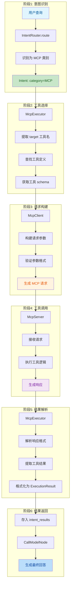
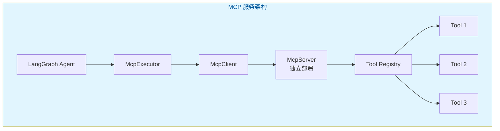
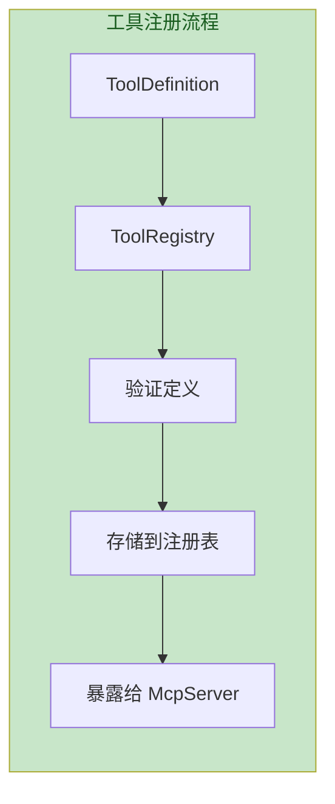
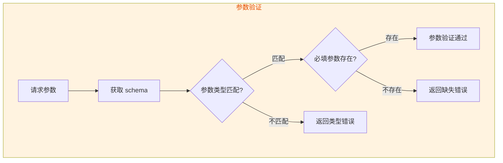
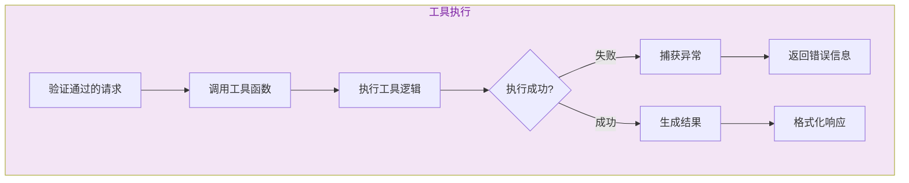

# MCP工具调用流程

> 文档版本：v1.0  
> 更新时间：2026-05-28  
> 核心模块：`server/mcp_module/`

---

## 目录

- [一、流程概述](#一流程概述)
- [二、完整流程图](#二完整流程图)
- [三、MCP架构设计](#三mcp架构设计)
- [四、工具注册机制](#四工具注册机制)
- [五、工具调用流程](#五工具调用流程)
- [六、现有工具列表](#六现有工具列表)
- [七、扩展指南](#七扩展指南)

---

## 一、流程概述

MCP（Model Context Protocol）工具系统支持调用外部工具服务：

| 步骤 | 功能 | 模块 |
|------|------|------|
| **意图识别** | 识别为 MCP 类别意图 | `IntentRouter` |
| **工具选择** | 选择对应工具 | `McpExecutor` |
| **请求构建** | 构建 MCP 请求 | `McpClient` |
| **工具调用** | 调用 MCP 服务 | `McpServer` |
| **结果解析** | 解析工具响应 | `McpExecutor` |

---

## 二、完整流程图



---

## 三、MCP架构设计

### 3.1 MCP服务架构



### 3.2 MCP协议结构

```python
# MCP请求
McpRequest(
    tool_name="web_search",
    parameters={
        "query": "人工智能最新进展",
        "limit": 5,
    },
)

# MCP响应
McpResponse(
    success=True,
    result={
        "results": [
            {"title": "...", "url": "...", "summary": "..."},
        ],
    },
)
```

---

## 四、工具注册机制

### 4.1 工具定义结构

```python
ToolDefinition(
    name="web_search",
    description="网络搜索工具",
    parameters={
        "query": {"type": "string", "required": True},
        "limit": {"type": "integer", "default": 5},
    },
    returns={
        "results": {"type": "array"},
    },
)
```

### 4.2 工具注册流程



---

## 五、工具调用流程

### 5.1 参数验证流程



### 5.2 工具执行流程



---

## 六、现有工具列表

| 工具名称 | 功能 | 参数 |
|----------|------|------|
| **web_search** | 网络搜索 | query, limit |
| **file_read** | 文件读取 | path |
| **file_write** | 文件写入 | path, content |
| **database_query** | 数据库查询 | sql |

---

## 七、扩展指南

### 7.1 新增MCP工具

```python
# 1. 定义工具
@tool_registry.register
def my_tool(param1: str, param2: int) -> dict:
    """
    我的自定义工具
    
    Args:
        param1: 参数1描述
        param2: 参数2描述
    
    Returns:
        执行结果
    """
    # 执行逻辑
    return {"result": "执行结果"}

# 2. 工具会自动注册到 McpServer
# 3. LangGraph Agent 可通过 Intent 调用
```

### 7.2 MCP服务部署

```yaml
# mcp_server.yaml
server:
  host: 0.0.0.0
  port: 8080
  
tools:
  - name: web_search
    module: tools.web_search
  - name: file_read
    module: tools.file_ops
```

---

## 相关文档

- [LangGraph状态图总览](./LangGraph状态图总览.md)
- [Direct模式流程](./Direct模式流程.md)
- [意图识别流程](./意图识别流程.md)