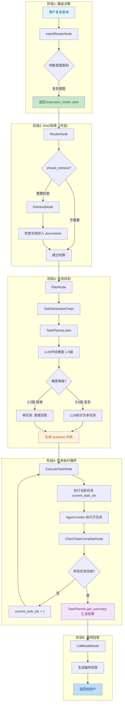
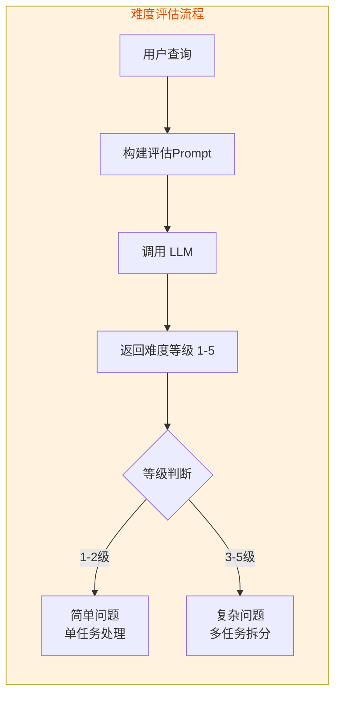
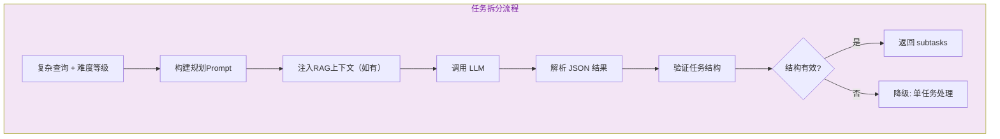
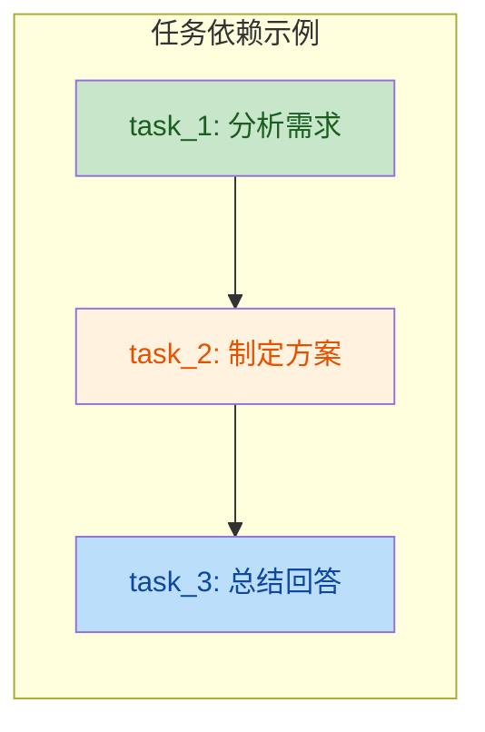
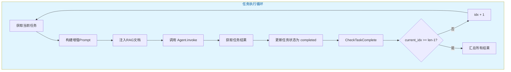
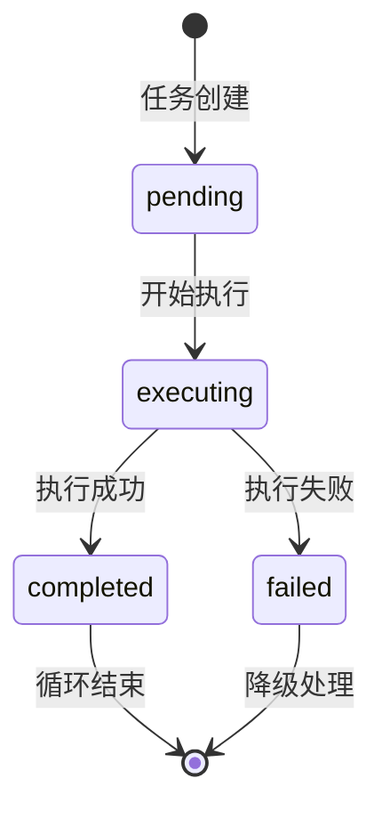

# Plan模式流程（任务规划）

> 文档版本：v1.0  
> 更新时间：2026-05-28  
> 核心模块：`server/modules/langgraph/planner/task_planner.py`

---

## 目录

- [一、流程概述](#一流程概述)
- [二、完整流程图](#二完整流程图)
- [三、难度评估机制](#三难度评估机制)
- [四、任务拆分策略](#四任务拆分策略)
- [五、任务执行循环](#五任务执行循环)
- [六、关键代码路径](#六关键代码路径)
- [七、配置项](#七配置项)

---

## 一、流程概述

Plan模式用于处理**复杂查询**，通过LLM评估难度并拆分为有序子任务：

| 难度等级 | 示例查询 | 任务数量 | 处理方式 |
|----------|----------|----------|----------|
| **1级** | "什么是人工智能" | 1 | 直接回答 |
| **2级** | "为什么天空是蓝色的" | 1 | 简单推理 |
| **3级** | "如何制定旅行计划" | 2 | 多步骤分析 |
| **4级** | "如何设计一个电商系统" | 3 | 综合多领域 |
| **5级** | "如何提高产品销量" | 4 | 创造性方案 |

---

## 二、完整流程图



---

## 三、难度评估机制

### 3.1 LLM难度评估流程



### 3.2 难度等级定义

| 等级 | 定义 | 示例 | 任务数 |
|------|------|------|--------|
| **1级** | 简单事实查询 | "什么是人工智能" | 1 |
| **2级** | 需要简单推理 | "为什么天空是蓝色的" | 1 |
| **3级** | 需要多步骤分析 | "如何制定旅行计划" | 2 |
| **4级** | 需要综合多领域知识 | "如何设计一个电商系统" | 3 |
| **5级** | 需要创造性解决方案 | "如何提高产品销量" | 4 |

---

## 四、任务拆分策略

### 4.1 LLM任务拆分流程



### 4.2 任务结构定义

```python
subtasks = [
    {
        "task_id": "task_1",              # 任务唯一标识
        "task_description": "分析需求",   # 任务描述
        "dependencies": [],               # 依赖的前置任务
        "status": "pending",              # 状态: pending/completed/failed
        "result": ""                      # 执行结果
    },
    {
        "task_id": "task_2",
        "task_description": "制定方案",
        "dependencies": ["task_1"],       # 依赖 task_1
        "status": "pending",
        "result": ""
    }
]
```

### 4.3 任务依赖关系



---

## 五、任务执行循环

### 5.1 执行循环流程



### 5.2 任务状态流转



### 5.3 结果汇总策略

| 任务数量 | 汇总方式 |
|----------|----------|
| 1个任务 | 直接返回任务结果 |
| 多个任务 | 拼接所有任务结果：`task_description: result` |

---

## 六、关键代码路径

| 步骤 | 文件 | 关键函数 | 行号 |
|------|------|----------|------|
| 路由决策 | [intent.py](file:///d:/办公/AI/langgraph-agent/server/modules/langgraph/nodes/intent.py) | `IntentRouterNode.__call__()` | L58-100 |
| RAG检索 | [rag.py](file:///d:/办公/AI/langgraph-agent/server/modules/langgraph/nodes/rag.py) | `RouterNode`, `RetrieveNode` | L16-85 |
| 任务规划 | [plan.py](file:///d:/办公/AI/langgraph-agent/server/modules/langgraph/nodes/plan.py) | `PlanNode.__call__()` | L15-49 |
| 难度评估 | [task_planner.py](file:///d:/办公/AI/langgraph-agent/server/modules/langgraph/planner/task_planner.py) | `_llm_evaluate_difficulty()` | L80-110 |
| 任务拆分 | [task_planner.py](file:///d:/办公/AI/langgraph-agent/server/modules/langgraph/planner/task_planner.py) | `_generate_plan_with_llm()` | L180-220 |
| 任务执行 | [execute.py](file:///d:/办公/AI/langgraph-agent/server/modules/langgraph/nodes/execute.py) | `ExecuteTaskNode.__call__()` | L60-105 |
| 完成检查 | [execute.py](file:///d:/办公/AI/langgraph-agent/server/modules/langgraph/nodes/execute.py) | `CheckTaskCompleteNode.__call__()` | L119-154 |
| 结果汇总 | [task_planner.py](file:///d:/办公/AI/langgraph-agent/server/modules/langgraph/planner/task_planner.py) | `get_summary()` | L335-361 |

---

## 七、配置项

| 环境变量 | 默认值 | 说明 |
|----------|--------|------|
| `TASK_PLANNER_MAX_TASKS` | 5 | 最大子任务数量 |
| `TASK_PLANNER_MIN_TASKS` | 1 | 最小子任务数量 |
| `TASK_PLANNER_ENABLE` | true | 是否启用规划 |

---

## 相关文档

- [LangGraph状态图总览](./LangGraph状态图总览.md)
- [意图识别流程](./意图识别流程.md)
- [RAG检索流程](./RAG检索流程.md)