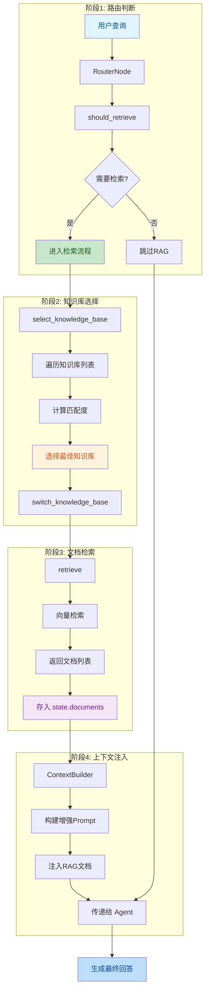
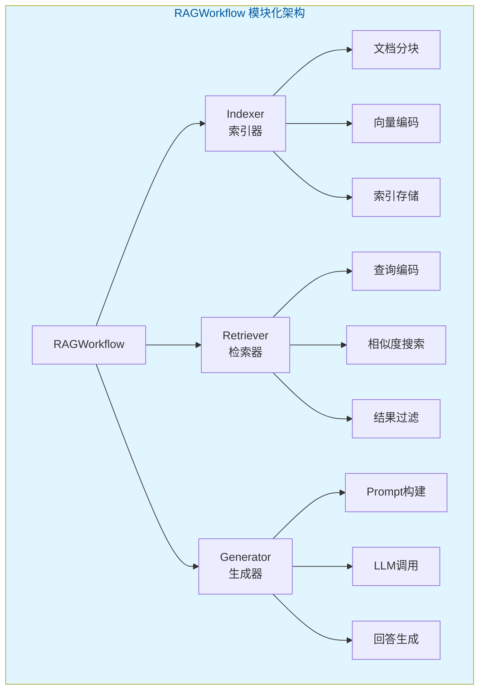
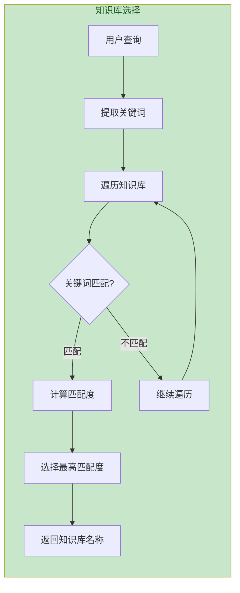
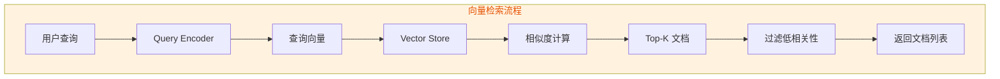
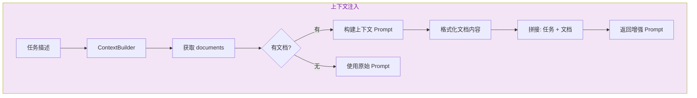

# RAG检索流程

> 文档版本：v1.0  
> 更新时间：2026-05-28  
> 核心模块：`server/modules/rag/`

---

## 目录

- [一、流程概述](#一流程概述)
- [二、完整流程图](#二完整流程图)
- [三、模块化架构](#三模块化架构)
- [四、知识库选择策略](#四知识库选择策略)
- [五、检索与生成](#五检索与生成)
- [六、关键代码路径](#六关键代码路径)

---

## 一、流程概述

RAG（检索增强生成）流程用于从知识库检索相关文档，增强LLM回答质量：

| 步骤 | 功能 | 模块 |
|------|------|------|
| **路由判断** | 判断是否需要检索 | `RouterNode` |
| **知识库选择** | 选择最合适的知识库 | `select_knowledge_base` |
| **文档检索** | 向量检索相关文档 | `retrieve` |
| **上下文注入** | 将文档注入到Prompt | `ContextBuilder` |

---

## 二、完整流程图



---

## 三、模块化架构

### 3.1 RAGWorkflow 组件结构



### 3.2 可插拔组件设计

| 组件 | 接口 | 可替换实现 |
|------|------|------------|
| **Indexer** | `index(documents)` | FAISS, Chroma, Pinecone |
| **Retriever** | `retrieve(query, k)` | 向量检索, BM25, 混合检索 |
| **Generator** | `generate(query, documents)` | OpenAI, Claude, 本地模型 |

---

## 四、知识库选择策略

### 4.1 知识库匹配流程



### 4.2 知识库类型

| 知识库 | 适用场景 | 关键词 |
|--------|----------|--------|
| **product_docs** | 产品文档 | 产品, 功能, 使用 |
| **tech_docs** | 技术文档 | 技术, API, 开发 |
| **faq** | 常见问题 | 问题, 帮助, FAQ |

---

## 五、检索与生成

### 5.1 向量检索流程



### 5.2 上下文注入流程



**上下文Prompt模板**：

```
参考文档：
{document_1}
{document_2}
...

任务：{task_description}

请根据参考文档完成上述任务。
```

---

## 六、关键代码路径

| 步骤 | 文件 | 关键函数 |
|------|------|----------|
| 路由判断 | [nodes/rag.py](file:///d:/办公/AI/langgraph-agent/server/modules/langgraph/nodes/rag.py) | `RouterNode.__call__()` |
| 知识库选择 | [rag_workflow.py](file:///d:/办公/AI/langgraph-agent/server/modules/rag/rag_workflow.py) | `select_knowledge_base()` |
| 文档检索 | [nodes/rag.py](file:///d:/办公/AI/langgraph-agent/server/modules/langgraph/nodes/rag.py) | `RetrieveNode.__call__()` |
| 上下文构建 | [context_builder.py](file:///d:/办公/AI/langgraph-agent/server/modules/langgraph/context_builder.py) | `ContextBuilder.build_task_with_context()` |

---

## 相关文档

- [LangGraph状态图总览](./LangGraph状态图总览.md)
- [Plan模式流程](./Plan模式流程.md)
- [Direct模式流程](./Direct模式流程.md)