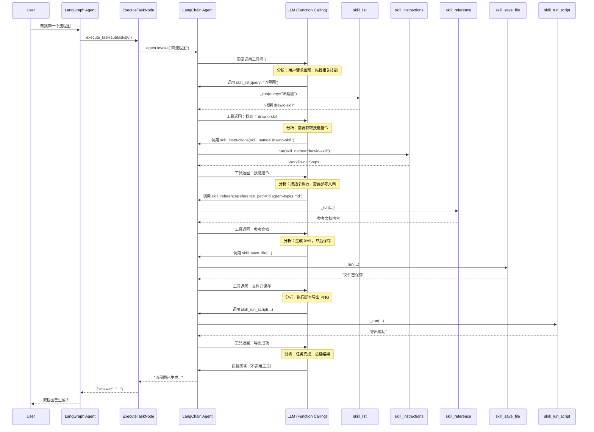
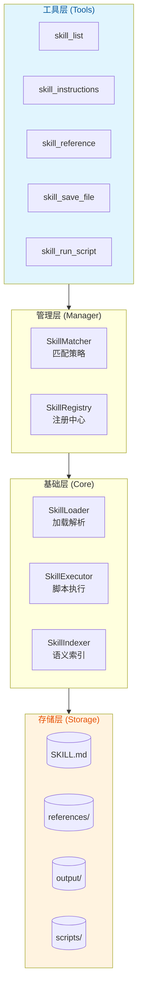

# 技能系统文档

基于 `pydantic-ai-skills` 的技能匹配和执行引擎，提供专业领域的深度服务。

---

## 目录

1. [技术架构](#技术架构)
2. [技能工具列表](#技能工具列表)
3. [内置技能](#内置技能)
4. [技能执行流程](#技能执行流程)
5. [代码模块对应关系](#代码模块对应关系)
6. [工具调用机制](#工具调用机制)
7. [技能安装流程](#技能安装流程)
8. [技能目录结构](#技能目录结构)
9. [SKILL.md 格式](#SKILL.md格式)
10. [开发自定义技能](#开发自定义技能)
11. [API 接口](#API接口)

---

## 技术架构

技能系统采用分层架构设计，使用业界成熟方案：

| 层级 | 组件 | 技术方案 | 职责 |
|------|------|---------|------|
| 加载层 | `SkillLoader` | `pydantic-ai-skills.SkillsToolset` | 技能发现和加载 |
| 匹配层 | `SkillMatcher` | 关键词匹配 / 语义检索 | 技能路由选择 |
| 执行层 | `SkillExecutor` | `subprocess` | 脚本安全执行 |
| 工具层 | `SkillTools` | `LangChain Tools` | Agent 工具封装 |
| 管理层 | `SkillManager` | - | 生命周期管理 |
| 安装层 | `SkillInstaller` | `pydantic-ai-skills` + GitHub API | 技能安装/卸载 |

---

## 技能工具列表

Agent 通过以下工具与技能系统交互：

| 工具名称 | 功能描述 | 调用时机 | 文件路径 |
|---------|---------|---------|---------|
| `skill_list` | 列出/搜索可用技能 | 发现技能阶段 | [tools/skill_list.py](file:///d:/办公/AI/langgraph-agent/server/modules/skill/tools/skill_list.py) |
| `skill_instructions` | 加载技能完整指令 | 确定使用技能后 | [tools/skill_instructions.py](file:///d:/办公/AI/langgraph-agent/server/modules/skill/tools/skill_instructions.py) |
| `skill_reference` | 读取技能参考文档 | 需要额外文档时 | [tools/skill_reference.py](file:///d:/办公/AI/langgraph-agent/server/modules/skill/tools/skill_reference.py) |
| `skill_save_file` | 保存生成内容到文件 | 生成 XML/JSON 等内容时 | [tools/skill_save_file.py](file:///d:/办公/AI/langgraph-agent/server/modules/skill/tools/skill_save_file.py) |
| `skill_run_script` | 执行技能脚本 | 需要运行脚本时 | [tools/skill_run_script.py](file:///d:/办公/AI/langgraph-agent/server/modules/skill/tools/skill_run_script.py) |

---

## 内置技能

| 技能名称 | 功能描述 | 触发关键词 |
|---------|---------|-----------|
| data-analysis | 数据分析、生成可视化报告 | 分析、报告、数据、统计、趋势 |
| drawio-skill | 绘制流程图、架构图 | 画图、流程图、架构图、设计 |
| tldraw-skill | 协作绘图、白板 | 白板、绘图、协作 |
| trip-plan | 旅行规划、行程安排 | 旅行、旅游、行程、攻略 |

---

## 技能执行流程

### 流程图

```
┌─────────────────────────────────────────────────────────────────────────────────────┐
│                              SKILL 执行流程                                          │
└─────────────────────────────────────────────────────────────────────────────────────┘

用户请求: "帮我画一个流程图"
        │
        ▼
┌───────────────────┐
│  1. skill_list    │  ← Agent 调用，搜索相关技能
│  query="画图 流程图"│
└─────────┬─────────┘
          │
          ▼
┌───────────────────┐
│  SkillMatcher     │  ← 关键词匹配
│  匹配: drawio-skill│
└─────────┬─────────┘
          │
          ▼
┌───────────────────┐
│2. skill_instructions│ ← 加载技能指令
│  skill_name=drawio │
└─────────┬─────────┘
          │
          ▼
┌───────────────────┐
│  SKILL.md 内容    │  ← 返回完整指令
│  - Workflow       │
│  - Step 0-7       │
└─────────┬─────────┘
          │
          ▼
┌───────────────────┐
│3. skill_reference │  ← 按需加载参考文档
│  diagram-types.md │
└─────────┬─────────┘
          │
          ▼
┌─────────────────────────────────────────────────────────────┐
│                    4. 执行 Workflow                            │
│                                                               │
│  ┌─────────────┐    ┌─────────────┐    ┌─────────────┐            │
│  │ Step 1      │───▶│ Step 2      │───▶│ Step 3      │───▶ ...  │
│  │ Check deps  │    │ Plan        │    │ Generate    │         │
│  └─────────────┘    └─────────────┘    └─────────────┘            │
│         │                  │                  │                │
│         ▼                  ▼                  ▼                │
│  检查 draw.io CLI    规划形状/布局      生成 .drawio XML          │
│                                            │                   │
│                                            ▼                   │
│                                   ┌───────────────────┐          │
│                                   │ 5. skill_save_file│        │
│                                   │  保存 XML 到文件   │         │
│                                   └─────────┬─────────┘          │
│                                             │                  │
│                                             ▼                  │
│                                   ┌───────────────────┐          │
│                                   │ 6. skill_run_script│       │
│                                   │  export to PNG    │        │
│                                   └─────────┬─────────┘          │
└─────────────────────────────────────┼─────────────────────────────┘
                                      │
                                      ▼
┌───────────────────────────────────────────────────────────────────┐
│                         7. 返回结果                              │
│                                                                  │
│  "流程图已生成：login_flow.drawio                                │
│   预览图：login_flow.drawio.png                                 │
│   您可以用 draw.io 打开编辑"                                     │
└───────────────────────────────────────────────────────────────────┘
```

---

## 代码模块对应关系

### 流程与代码映射表

| 流程步骤 | 代码模块 | 类/方法 | 文件路径 |
|---------|---------|---------|---------|
| 搜索技能 | `skill_list` | `SkillListTool._run()` | [tools/skill_list.py](file:///d:/办公/AI/langgraph-agent/server/modules/skill/tools/skill_list.py) |
| 匹配技能 | `SkillMatcher` | `SkillMatcher.match_by_keywords()` | [matcher.py](file:///d:/办公/AI/langgraph-agent/server/modules/skill/matcher.py) |
| 加载指令 | `skill_instructions` | `SkillInstructionsTool._run()` | [tools/skill_instructions.py](file:///d:/办公/AI/langgraph-agent/server/modules/skill/tools/skill_instructions.py) |
| 读取参考 | `skill_reference` | `SkillReferenceTool._run()` | [tools/skill_reference.py](file:///d:/办公/AI/langgraph-agent/server/modules/skill/tools/skill_reference.py) |
| 保存文件 | `skill_save_file` | `SkillSaveFileTool._run()` | [tools/skill_save_file.py](file:///d:/办公/AI/langgraph-agent/server/modules/skill/tools/skill_save_file.py) |
| 执行脚本 | `skill_run_script` | `SkillRunScriptTool._run()` | [tools/skill_run_script.py](file:///d:/办公/AI/langgraph-agent/server/modules/skill/tools/skill_run_script.py) |

### 核心类详解

#### 1. SkillMatcher - 技能匹配器

```python
# server/modules/skill/matcher.py
class SkillMatcher:
    def match_by_keywords(self, query: str) -> Optional[Dict[str, Any]]:
        """基于关键词匹配技能（兜底策略）"""
        query_lower = query.lower()
        skills = self._loader.list_skills()
        for skill in skills:
            desc = skill.get("description", "").lower()
            name = skill.get("name", "").lower()
            if query_lower in desc or query_lower in name:
                return skill
        return None

    def match_by_semantic(self, query: str, threshold: float = 1.5):
        """基于语义向量相似度匹配"""
```

#### 2. SkillLoader - 技能加载器

```python
# server/modules/skill/loader.py
class SkillLoader:
    def load_skill(self, skill_name: str) -> Optional[Dict[str, Any]]:
        """加载技能完整内容（SKILL.md）"""
        skill_dir = self._get_skill_dir(skill_name)
        skill_md = skill_dir / "SKILL.md"
        return self._parse_skill_md(skill_md)

    def get_reference(self, skill_name: str, path: str) -> Optional[str]:
        """加载参考文档"""
        ref_file = skill_dir / "references" / path
        return ref_file.read_text()
```

#### 3. SkillExecutor - 技能执行器

```python
# server/modules/skill/executor.py
class SkillExecutor:
    def run_script(self, skill_name: str, script_path: str,
                   args: List[str], timeout: int) -> Dict[str, Any]:
        """执行技能脚本（隔离工作目录）"""
        skill_dir = self._loader.get_skill_path(skill_name)
        result = subprocess.run(
            ["python", str(full_path)] + args,
            cwd=skill_dir,
            timeout=timeout,
            capture_output=True
        )
        return {"success": result.returncode == 0, "output": result.stdout}
```

---

## 工具调用机制

### 调用时序图



### 工具调用决策原理

| 问题 | 答案 |
|------|------|
| **谁调用工具？** | **LangChain Agent**（通过 LLM 的 Function Calling 能力） |
| **怎么知道调用顺序？** | LLM 阅读 **SKILL.md 中的 instructions** 自主决策 |
| **为什么调用这些工具？** | 工具的 `description` 字段告诉 LLM 何时调用 |
| **谁决定何时停止？** | LLM 判断任务完成后，直接生成回答 |

### 架构分层图



---

## 技能安装流程

```
GitHub URL → SkillInstaller.install_from_url()
                    │
                    ├── 1. 解析 GitHub URL
                    │      提取: user, repo, branch, path
                    │
                    ├── 2. 下载 ZIP 包
                    │      API: /repos/{user}/{repo}/zipball/{branch}
                    │
                    ├── 3. 解压到 skills/{skill_name}/
                    │
                    ├── 4. SkillsToolset.reload()
                    │      重新扫描技能目录
                    │
                    └── 5. 返回安装结果
```

### 安装示例

```python
from api.skill_installer import get_installer

installer = get_installer()

# 从 GitHub 安装
result = installer.install_from_url("https://github.com/Agents365-ai/drawio-skill")
print(result.message)  # 技能 drawio-skill 安装成功

# 列出已安装技能
skills = installer.list_installed()
print(skills)  # ['data-analysis', 'drawio-skill', 'tldraw-skill']

# 获取技能信息
info = installer.get_skill_info("drawio-skill")
print(info['description'])

# 卸载技能
installer.uninstall("drawio-skill")
```

---

## 技能目录结构

```
skills/
├── data-analysis/            # 数据分析技能
│   └── SKILL.md
├── drawio-skill/             # 流程图绘制技能
│   ├── SKILL.md              # 技能定义（必需）
│   ├── references/           # 参考文档
│   │   ├── diagram-types.md
│   │   ├── style-extraction.md
│   │   ├── style-presets.md
│   │   └── troubleshooting.md
│   ├── scripts/              # 可执行脚本
│   │   ├── encode_drawio_url.py
│   │   └── repair_png.py
│   ├── styles/               # 样式配置
│   │   ├── built-in/
│   │   │   ├── corporate.json
│   │   │   ├── default.json
│   │   │   └── handdrawn.json
│   │   └── schema.json
│   └── output/               # 输出目录（自动创建）
├── tldraw-skill/             # 白板协作技能
│   └── SKILL.md
└── trip-plan/                # 旅行规划技能
    └── SKILL.md
```

---

## SKILL.md 格式

```yaml
---
name: drawio-skill
version: 1.5.2
description: Use when the user requests diagrams, flowcharts...
license: MIT
homepage: https://github.com/Agents365-ai/drawio-skill
metadata:
  author: Agents365-ai
  version: 1.5.2
---

# Draw.io Diagrams

## Overview
Generate .drawio XML files...

## Workflow
Step 1: Check deps
Step 2: Plan
Step 3: Generate
...
```

### 元数据字段说明

| 字段 | 必需 | 说明 |
|------|------|------|
| `name` | 是 | 技能唯一标识，用于匹配和调用 |
| `version` | 是 | 版本号，遵循语义化版本 |
| `description` | 是 | 技能描述，用于 `skill_list` 展示 |
| `license` | 否 | 开源协议 |
| `homepage` | 否 | 项目主页 |
| `metadata` | 否 | 扩展元数据（author、tags 等） |

---

## 开发自定义技能

### 1. 创建技能目录

```bash
mkdir -p skills/my-skill
```

### 2. 编写 SKILL.md

```yaml
---
name: my-skill
version: 1.0.0
description: 我的自定义技能
---

# My Skill

## Overview
技能功能说明...

## Workflow
Step 1: xxx
Step 2: xxx
```

### 3. 添加脚本（可选）

```bash
mkdir -p skills/my-skill/scripts
# 创建 scripts/process.py
```

### 4. 添加参考文档（可选）

```bash
mkdir -p skills/my-skill/references
# 创建 references/api.md
```

---

## API 接口

### 安装技能

```http
POST /api/skills/install
Content-Type: application/json

{
  "url": "https://github.com/user/skill-repo"
}
```

### 列出技能

```http
GET /api/skills/list
```

响应：
```json
{
  "skills": [
    {
      "name": "drawio-skill",
      "description": "绘制流程图、架构图",
      "version": "1.5.2",
      "path": "/path/to/skills/drawio-skill"
    }
  ]
}
```

### 卸载技能

```http
DELETE /api/skills/{skill_name}
```