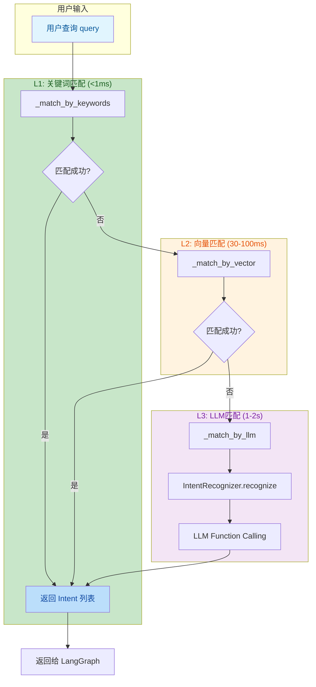
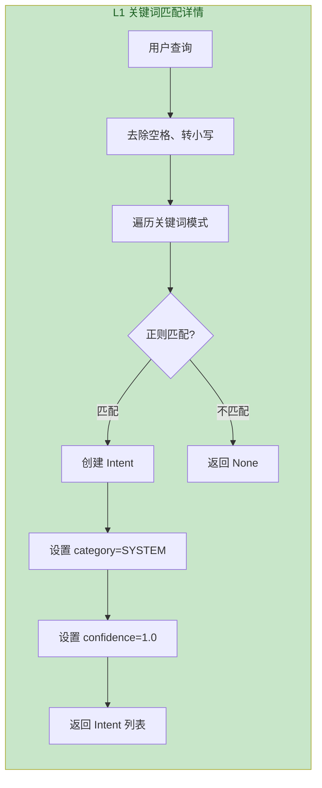
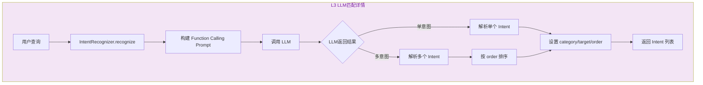
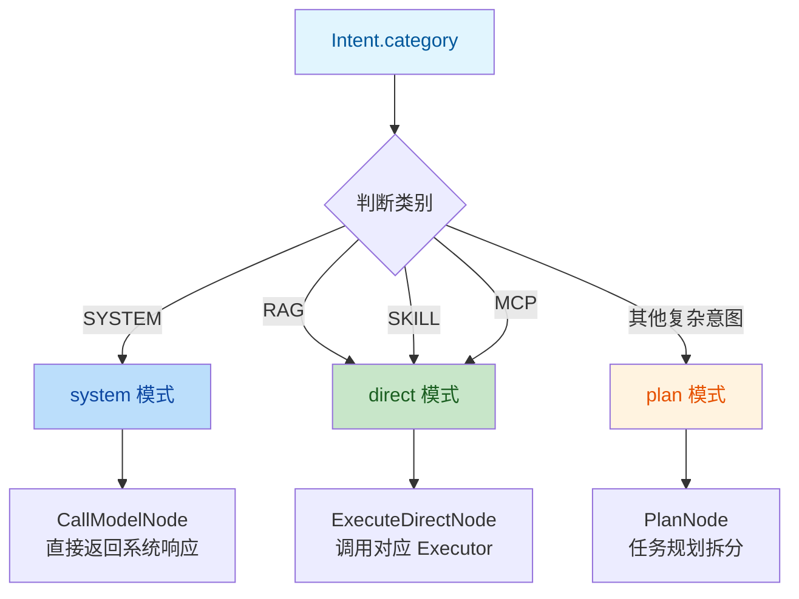
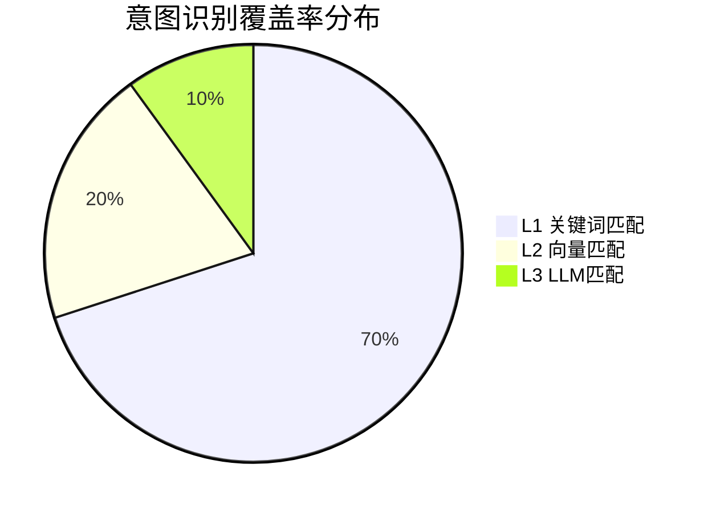

# 意图识别流程（分层漏斗路由）

> 文档版本：v1.0  
> 更新时间：2026-05-28  
> 核心模块：`server/modules/intent/router.py`

---

## 目录

- [一、流程概述](#一流程概述)
- [二、分层漏斗架构](#二分层漏斗架构)
- [三、详细流程图](#三详细流程图)
- [四、关键代码路径](#四关键代码路径)
- [五、性能指标](#五性能指标)
- [六、扩展指南](#六扩展指南)

---

## 一、流程概述

意图识别采用**分层漏斗路由**架构，按优先级依次尝试匹配：

| 层级 | 匹配方式 | 延迟 | 覆盖率 | 适用场景 |
|------|----------|------|--------|----------|
| **L1** | 关键词/正则 | <1ms | 60-80% | 固定指令、系统命令 |
| **L2** | 向量语义 | 30-100ms | 15-25% | 同义改写、相似查询 |
| **L3** | 大模型 FC | 1-2s | 5-15% | 复杂请求、多意图 |

---

## 二、分层漏斗架构



---

## 三、详细流程图

### 3.1 L1 关键词匹配流程



**关键词模式表**：

| 正则模式 | 意图类型 | 描述 |
|----------|----------|------|
| `^/help$` | `system_help` | 系统帮助 |
| `^help$` | `system_help` | 系统帮助 |
| `^exit$` | `system_exit` | 退出系统 |
| `^quit$` | `system_exit` | 退出系统 |
| `^(是|yes|确认)$` | `system_confirm` | 确认 |
| `^(否|no|取消)$` | `system_cancel` | 取消 |

---

### 3.2 L3 LLM匹配流程



**Intent 对象结构**：

```python
Intent(
    type="rag_query",           # 意图类型
    category=IntentCategory.RAG, # 意图类别 (RAG/SKILL/MCP/SYSTEM)
    content="查询文档内容",      # 原始内容
    target="knowledge_base",     # 目标对象
    order=1,                     # 执行顺序（多意图时）
    confidence=0.9,              # 置信度
)
```

---

### 3.3 意图类别与执行模式映射



---

## 四、关键代码路径

| 步骤 | 文件 | 关键函数 | 行号 |
|------|------|----------|------|
| 路由入口 | [router.py](file:///d:/办公/AI/langgraph-agent/server/modules/intent/router.py) | `IntentRouter.route()` | L81-92 |
| L1关键词 | [router.py](file:///d:/办公/AI/langgraph-agent/server/modules/intent/router.py) | `_match_by_keywords()` | L94-120 |
| L2向量 | [router.py](file:///d:/办公/AI/langgraph-agent/server/modules/intent/router.py) | `_match_by_vector()` | L122-145 |
| L3 LLM | [router.py](file:///d:/办公/AI/langgraph-agent/server/modules/intent/router.py) | `_match_by_llm()` | L147-160 |
| LLM识别 | [recognizer.py](file:///d:/办公/AI/langgraph-agent/server/modules/intent/recognizer.py) | `IntentRecognizer.recognize()` | - |
| 意图类型 | [intent_types.py](file:///d:/办公/AI/langgraph-agent/server/modules/intent/intent_types.py) | `Intent`, `IntentCategory` | - |

---

## 五、性能指标

### 5.1 延迟对比

| 层级 | 平均延迟 | P99延迟 | 适用场景 |
|------|----------|---------|----------|
| L1 | <1ms | 2ms | 系统指令、固定命令 |
| L2 | 50ms | 100ms | 同义改写（暂未实现） |
| L3 | 1.5s | 2s | 复杂请求、多意图 |

### 5.2 覆盖率分布



---

## 六、扩展指南

### 6.1 新增关键词模式

```python
# router.py _init_keyword_patterns()
self._keyword_patterns = {
    r"^/help$": ("system_help", "系统帮助"),
    # 新增模式
    r"^/status$": ("system_status", "系统状态"),
    r"^/version$": ("system_version", "版本信息"),
}
```

### 6.2 新增意图类别

```python
# intent_types.py IntentCategory
class IntentCategory(Enum):
    RAG = "rag"
    SKILL = "skill"
    MCP = "mcp"
    SYSTEM = "system"
    # 新增类别
    WEB_SEARCH = "web_search"  # 网络搜索
```

### 6.3 实现L2向量匹配

```python
# router.py _match_by_vector()
def _match_by_vector(self, query: str) -> Optional[List[Intent]]:
    if not self.vector_store:
        return None
    
    # 1. 从向量库检索相似示例
    results = self.vector_store.similarity_search(query, k=3)
    
    # 2. 根据相似度判断
    if results and results[0].score > 0.8:
        # 3. 映射到意图类型
        intent_type = results[0].metadata.get("intent_type")
        return [Intent(type=intent_type, ...)]
    
    return None
```

---

## 相关文档

- [LangGraph状态图总览](./LangGraph状态图总览.md)
- [Direct模式流程](./Direct模式流程.md)
- [Plan模式流程](./Plan模式流程.md)