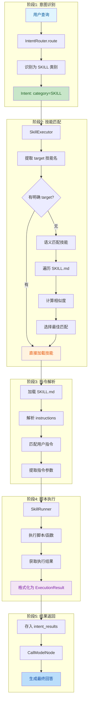
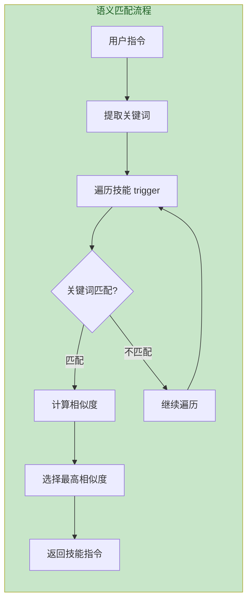
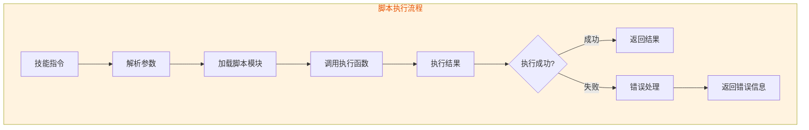

# 技能系统流程

> 文档版本：v1.0  
> 更新时间：2026-05-28  
> 核心模块：`server/modules/skill/`, `server/skills/`

---

## 目录

- [一、流程概述](#一流程概述)
- [二、完整流程图](#二完整流程图)
- [三、技能定义结构](#三技能定义结构)
- [四、技能匹配机制](#四技能匹配机制)
- [五、技能执行流程](#五技能执行流程)
- [六、现有技能列表](#六现有技能列表)
- [七、扩展指南](#七扩展指南)

---

## 一、流程概述

技能系统通过 `SKILL.md` 定义技能，支持语义匹配和脚本执行：

| 步骤 | 功能 | 模块 |
|------|------|------|
| **意图识别** | 识别为 SKILL 类别意图 | `IntentRouter` |
| **技能匹配** | 根据语义匹配技能 | `SkillMatcher` |
| **指令解析** | 解析技能指令 | `SkillExecutor` |
| **脚本执行** | 执行技能脚本 | `SkillRunner` |

---

## 二、完整流程图



---

## 三、技能定义结构

### 3.1 SKILL.md 结构

```markdown
# 技能名称

## 基本信息
- 名称: drawio-skill
- 描述: 使用DrawIO创建各种图表
- 版本: 1.0.0

## 指令列表
### 指令1: 创建流程图
- 触发词: 流程图, 流程, diagram
- 参数: title, nodes, edges
- 示例: 创建一个用户登录流程图

### 指令2: 创建思维导图
- 触发词: 思维导图, mindmap
- 参数: topic, branches
- 示例: 创建一个项目规划思维导图

## 执行脚本
- 路径: scripts/create_diagram.py
- 函数: create_flowchart(title, nodes, edges)
```

### 3.2 技能元数据

```python
SkillMetadata(
    name="drawio-skill",
    description="使用DrawIO创建各种图表",
    version="1.0.0",
    instructions=[
        SkillInstruction(
            trigger=["流程图", "diagram"],
            action="create_flowchart",
            params=["title", "nodes", "edges"],
        ),
    ],
    script_path="scripts/create_diagram.py",
)
```

---

## 四、技能匹配机制

### 4.1 语义匹配流程



### 4.2 匹配优先级

| 优先级 | 匹配方式 | 说明 |
|--------|----------|------|
| **1** | 明确 target | Intent 中指定技能名 |
| **2** | 关键词匹配 | 用户指令包含 trigger 词 |
| **3** | 语义相似度 | 向量相似度匹配 |

---

## 五、技能执行流程

### 5.1 脚本执行流程



### 5.2 参数提取

```python
# 用户输入: "创建一个用户登录流程图"
# 匹配指令: create_flowchart
# 提取参数:
params = {
    "title": "用户登录流程图",
    "nodes": ["开始", "输入账号", "验证", "成功", "失败"],
    "edges": [("开始", "输入账号"), ("输入账号", "验证"), ...],
}
```

---

## 六、现有技能列表

| 技能名称 | 功能 | 触发词 |
|----------|------|--------|
| **drawio-skill** | 创建DrawIO图表 | 流程图, 思维导图, diagram |
| **tldraw-skill** | 创建TLDraw白板 | 白板, 绘图, tldraw |
| **data-analysis** | 数据分析 | 分析, 统计, 数据 |
| **trip-plan** | 旅行规划 | 旅行, 行程, 规划 |

---

## 七、扩展指南

### 7.1 新增技能步骤

1. **创建技能目录**

```
server/skills/my-skill/
├── SKILL.md          # 技能定义
├── scripts/          # 执行脚本
│   └── main.py
└── references/       # 参考文档（可选）
```

2. **编写 SKILL.md**

```markdown
# my-skill

## 基本信息
- 名称: my-skill
- 描述: 我的自定义技能

## 指令列表
### 指令1: 执行某操作
- 触发词: 关键词1, 关键词2
- 参数: param1, param2
```

3. **实现执行脚本**

```python
# scripts/main.py
def execute_action(param1, param2):
    # 执行逻辑
    return {"result": "执行结果"}
```

---

## 相关文档

- [LangGraph状态图总览](./LangGraph状态图总览.md)
- [Direct模式流程](./Direct模式流程.md)
- [SKILL.md 示例](../server/skills/drawio-skill/SKILL.md)